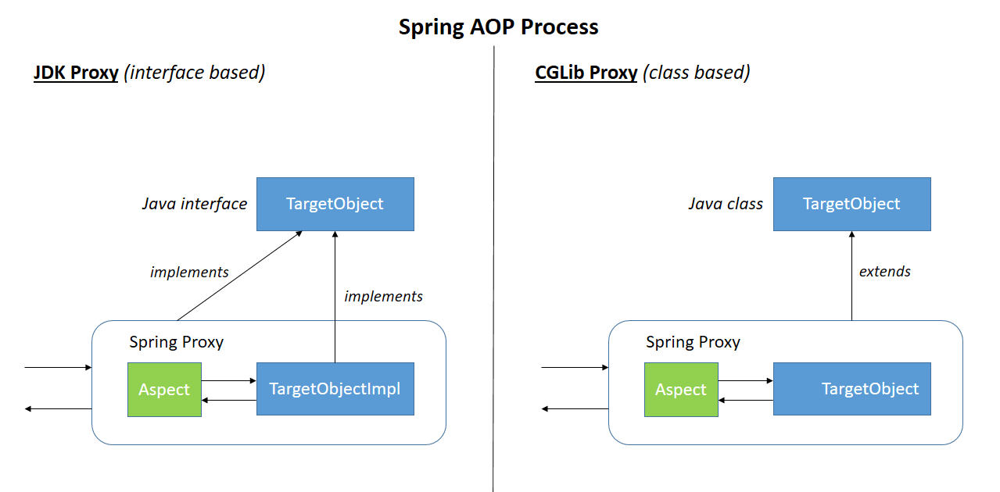

# AOP Mechanisms
## 1. Spring AOP 선언 방식
Spring AOP는 Aspect를 선언하는 두 가지 방법을 지원한다.

### (1) Schema-based (XML 기반)
- `<aop:config>`, `<aop:aspect>` 등의 태그를 사용하여 XML에서 AOP를 선언한다.
- 과거 XML 중심 설정 시 사용되던 방식으로, 명시적으로 설정할 수 있으나 현재는 잘 사용되지 않는다.

### (2) @AspectJ 기반 (어노테이션 기반)
- `@Aspect`, `@Before`, `@Around` 등의 애노테이션을 사용해 코드 수준에서 AOP를 구성한다.
- AspectJ 표현식 (execution(..), within(..) 등)을 사용 가능하다.
- 가장 보편적이며, Spring의 DI와 함께 사용하기 좋은 방식이다.


---

## 2. Proxying Mechanisms
- Spring AOP 프록시는 대상 메서드 호출을 가로채고, Advice 체인을 적용하는 방식으로 동작한다.


### 프록시 생성 방식 (JDK vs CGLIB)

| 방식 | 설명 |
|------|------|
| **JDK 동적 프록시** | 대상 객체가 **인터페이스를 구현한 경우**에 사용됨. 해당 인터페이스를 구현하는 프록시 객체가 생성됨 |
| **CGLIB 프록시** | 대상 클래스가 **인터페이스를 구현하지 않은 경우**, **CGLIB**를 사용해 런타임에 클래스를 상속한 프록시 객체를 생성함 |





- Spring 최신 환경에서는 클래스 기반(CGLIB) 프록시를 기본으로 사용한다.
- 예를 들어 Spring Boot에서는 별도 설정이 없으면 `proxyTargetClass=true` 설정을 통해 모든 프록시를 CGLIB 방식으로 생성한다.​
- 이는 인터페이스 유무와 관계없이 프록시를 동일한 방식으로 처리하고, 인터페이스에 정의되지 않은 메서드까지 포함하여 프록시로 처리하기 위함이다.


### 프록시 생성 방식에 따른 메서드 인터셉트 원리 (JDK vs CGLIB)

| 생성 방식 | 메서드 인터셉트 원리 |
|------|--------------------|
| **JDK 동적 프록시**  | `InvocationHandler`를 통해 모든 메서드 호출을 `invoke()` 메서드로 가로챔 (인터페이스 기반) |
| **CGLIB 프록시** | 바이트코드 조작 라이브러리인 CGLIB을 통해 타겟 클래스를 상속한 프록시 클래스를 런타임에 생성하고, `MethodInterceptor`를 통해 메서드 호출을 가로챔 (클래스 기반) |


---


## 3. Spring AOP 방식별 주의 사항

| 주의점 | 설명 |
|--------|------|
| **내부 호출 (self-invocation)** | 같은 클래스 내 메서드 간 호출은 프록시를 거치지 않음 → Advice가 적용되지 않음 |
| **final 클래스/메서드** | CGLIB는 final 클래스를 상속하거나 final 메서드를 오버라이드할 수 없기 때문에 AOP 적용이 불가능함 |
| **private 메서드** | AOP는 public/protected 메서드 수준에서만 적용 가능. private 메서드는 JoinPoint 생성이 되지 않음 |
| **빈이 아닌 객체** | AOP는 Spring IoC 컨테이너가 관리하는 Bean에만 적용됨. new로 생성한 객체나 외부 객체에는 적용되지 않음 |


### Self-invocation(내부 호출, 자기 호출) 문제
- 프록시는 외부에서 메서드가 호출될 때만 Advice를 적용할 수 있다.
- 내부 호출(this)은 원본 객체 기준이므로 프록시를 우회하게 된다.
- 즉, `this.inner()`은 프록시 객체의 메서드가 아닌 원본 객체의 메서드를 직접 호출하는 것이기 때문에 AOP가 적용되지 않는다.

```java
public class SimpleService {
    public void outer() {
        this.inner(); // ⚠️ this로 직접 호출하면 Advice가 적용 x
    }

    @Transactional
    public void inner() { ... }
}

```

---
ref.
- [docs: AOP Declaration Style](https://docs.spring.io/spring-framework/reference/core/aop/choosing.html)
- [docs: Proxying Mechanisms](https://docs.spring.io/spring-framework/reference/core/aop/proxying.html)
