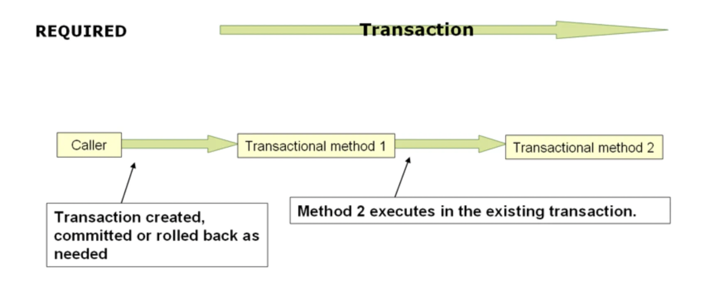
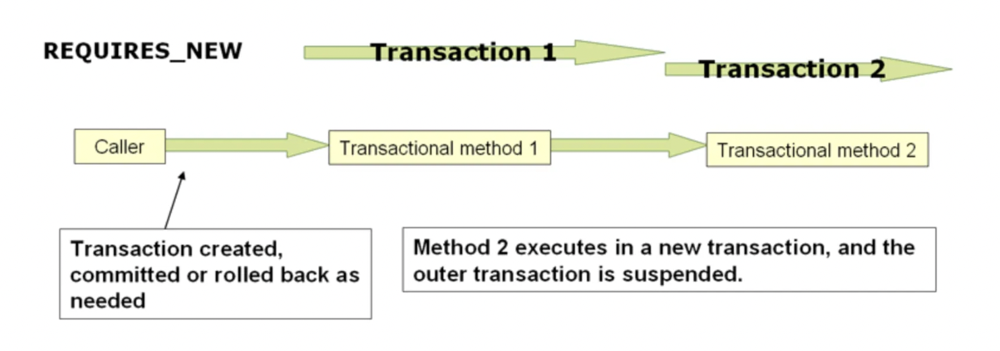

# Transaction Management


## 선언적 트랜잭션

선언적 트랜잭션 방식으로 트랜잭션을 적용하려면 아래와 같이 적용할 Java 코드에 바로 작성하면 된다.

```java
// the service class that we want to make transactional

@Transactional
public class DefaultFooService implements FooService {

	@Override
	public Foo getFoo(String fooName) {
		// ...
	}

	@Override
	public Foo getFoo(String fooName, String barName) {
		// ...
	}

	@Override
	public void insertFoo(Foo foo) {
		// ...
	}

	@Override
	public void updateFoo(Foo foo) {
		// ...
	}
}
```

- 위와 같이 클래스 레벨에 @Transactional을 선언하면 내부 모든 메서드에 트랜잭션이 적용된다.
- 상위(조상) 클래스에는 @Transactional이 적용되지 않는다. 적용하고 싶다면 Override를 하면 된다.


### 설정

```java
 @Configuration
 @EnableTransactionManagement
 public class AppConfig {
     @Bean
     public PlatformTransactionManager txManager() {
         return new DataSourceTransactionManager(dataSource());
     }

    // 아래와 같이 @Bean을 등록해야 함.
    @Bean
    public FooService fooService() {
        return new DefaultFooService();
    }
 }
```

- @EnableTransactionManagement이 선언된 설정 클래스에 POJO를 @Bean으로 등록해야 @Transcational이 정상 동작한다.


### Reactive Transactional

Reactive Transactional 방식에서는 아래와 같이 반응형 반환 타입을 사용한다. (이건 나중에 Spring WebFlux 공부하고 다시 봐야할듯.)

```java
// the reactive service class that we want to make transactional
@Transactional
public class DefaultFooService implements FooService {

	@Override
	public Publisher<Foo> getFoo(String fooName) {
		// ...
	}

	@Override
	public Mono<Foo> getFoo(String fooName, String barName) {
		// ...
	}

	@Override
	public Mono<Void> insertFoo(Foo foo) {
		// ...
	}

	@Override
	public Mono<Void> updateFoo(Foo foo) {
		// ...
	}
}
```


### 메소드 가시성

- Spring 6.0부터 구체 클래스 상속 방식(CGLIB)는 public, protected에 @Transactional을 적용할 수 있다.
  - Proxy-target-class : true로 설정하면 CGLIB
- JDK 동적 프록시 방식은 반드시 public으로 선언해야 @Transactional을 적용할 수 있다.
  - Proxy-target-class : false로 설정하면 JDK 동적 프록시


### 프록시 모드에서 @Transcational

* @Transactional은 인터페이스 정의, 인터페이스 메서드, 클래스 정의, 클래스 메서드에 적용할 수 있지만 꼭 이게 있다고 트랜잭션을 사용할 수 있는 것은 아니다.

  - XML 설정 : [tx:annotation-driven/](tx:annotation-driven/)

  - Java 코드 : @EnableTransactionManagement

-> XML 설정이나 Java 코드가 반드시 존재해야 트랜잭션을 적용할 수 있다.

* 주의점

  - Java 에노테이션은 상속되지 않기 때문에 AspectJ를 사용할 때 Weaving되지 않는다. 구체 클래스에 @Transactional을 붙이자.

  - 프록시를 사용할 때 내부 호출을 하게 되면 @Transactional을 붙이더라도 적용되지 않을 수 있다.
    - 내부 호출로 트랜잭션을 사용해야 하는 경우에는 AspectJ를 사용하는 것을 검토하자.
    - 컴파일, 클래스 로드 시점에 Weaving되어 바이트 코드를 조작하는 방식으로 돌아가기 때문에 문제가 해결된다.


### Transaction 적용

```java
@Transactional(readOnly = true)
public class DefaultFooService implements FooService {

	public Foo getFoo(String fooName) {
		// ...
	}

	// these settings have precedence for this method
	@Transactional(readOnly = false, propagation = Propagation.REQUIRES_NEW)
	public void updateFoo(Foo foo) {
		// ...
	}
}
```

- 클래스 단위의 트랜잭션보다 메서드 수준의 트랜잭션이 더 우선순위를 가진다.


### Transaction Setting

기본 트랜잭션 설정값은 아래와 같다.

- Propagation : PROPAGATION_REQUIRED
- Isolation Level : ISOLATION_DEFAULT
- transaction : read-write
- timeout
- RuntimeException OR Error → Rollback, CheckedException → Not Rollback

| Property                                                     | Type                                                         | Description                                                  |
| ------------------------------------------------------------ | ------------------------------------------------------------ | ------------------------------------------------------------ |
| [value](https://docs.spring.io/spring-framework/reference/data-access/transaction/declarative/annotations.html#tx-multiple-tx-mgrs-with-attransactional) | `String`                                                     | 어떤 TransactionManager를 사용할 지                          |
| `transactionManager`                                         | `String`                                                     | Value의 Alias                                                |
| `label`                                                      | Array of `String` labels to add an expressive description to the transaction. | 사용자 정의 설명, 나중에 로깅 등에 사용 가능                 |
| [propagation](https://docs.spring.io/spring-framework/reference/data-access/transaction/declarative/tx-propagation.html) | `enum`: `Propagation`                                        | 전파 속성, REQUIRED_NEW, REQUIRED, NESTED, ..etc             |
| `isolation`                                                  | `enum`: `Isolation`                                          | 격리 수준 설정`REQUIRED` or `REQUIRES_NEW`에 설정            |
| `timeout`                                                    | `int` (in seconds of granularity)                            | `REQUIRED` or `REQUIRES_NEW`에 설정 가능하고 타임 아웃 설정  |
| `timeoutString`                                              | `String` (in seconds of granularity)                         | 타임 아웃 설정                                               |
| `readOnly`                                                   | `boolean`                                                    | `REQUIRED` or `REQUIRES_NEW`에 적용 가능하고 read-only, not read-only 설정 가능 |
| `rollbackFor`                                                | Array of `Class` objects, which must be derived from `Throwable.` | rollback해야 하는 예외 타입들, 반드시                        |
| `rollbackForClassName`                                       | Array of exception name patterns.                            | 반드시 rollback해야 하는 예외 이름 타입                      |
| `noRollbackFor`                                              | Array of `Class` objects, which must be derived from `Throwable.` | 롤백되면 안되는 예외들.                                      |
| `noRollbackForClassName`                                     | Array of exception name patterns.                            | 롤백되면 안되는 예외 이름 패턴                               |

- Spring 6.2부터 기본 롤백 동작을 전역에서 변경할 수 있다.
  - @EnableTransactionManagement(rollbackOn=ALL_EXCEPTIONS)를 통해 checked Exception을 포함한 모든 예외에 대한 롤백이 가능하다. (기본은 UnCheckedException만 롤백)
    - EJB 스타일의 비즈니스 예외에 의존하지 않는다면 ALL_EXCEPTIONS 설정을 하고 Checked Exception에 대해서도 롤백을 해주면 좋다.
    - kotlin은 모든 예외가 UnChecked Exception으로 처리되어 일관성이 있다. Kotlin으로 전환하던가 Java를 쓸거면 ALL_EXCEPTIONS 설정을 해서 일관성을 가져가자.
  - 커스텀해서 사용하려면 AnnotationTransactionAttributeSource의 addDefaultRollbackRule(RollbackRuleAttribute) 메소드를 제공하니 가져다 쓰면 된다.


* 현재 트랜잭션 이름(트랜잭션 모니터, 로깅 출력에 나타나는 트랜잭션 이름) 은 명시적으로 제어할 수 없다.
  - 트랜잭션이 붙은 handlePayment() 라는 메서드가 BusinessService에 있다면 이름은 com.example.BusinessService.handlePayment가 된다.


### 다중 트랜잭션 매니저, @Transactional

- 대부분의 Spring 애플리케이션의 경우 단일 TransactionManager만 필요한데 단일 애플리케이션에서 여러 독립적인 TransactionManager가 필요한 상황도 존재한다.

```java
public class TransactionalService {

	@Transactional("order")
	public void setSomething(String name) { ... }

	@Transactional("account")
	public void doSomething() { ... }

	@Transactional("reactive-account")
	public Mono<Void> doSomethingReactive() { ... }
}
```

- 위와 같이 각 TransactionManager(order, account, reactive-account)와 매핑할 수 있다.
- 모두 다른 dataSource라고 생각하면 될듯?


### Custom Annotation

```java
@Target({ElementType.METHOD, ElementType.TYPE})
@Retention(RetentionPolicy.RUNTIME)
@Transactional(transactionManager = "order", label = "causal-consistency")
public @interface OrderTx {
}

@Target({ElementType.METHOD, ElementType.TYPE})
@Retention(RetentionPolicy.RUNTIME)
@Transactional(transactionManager = "account", label = "retryable")
public @interface AccountTx {
}
```

- 반복되는 @Transactional 설정이 있고 특수한 목적으로 사용할거면 별도의 에노테이션으로 만들어서 사용할 수 있다.
- 스프링 트랜잭션을 사용할 때 물리 트랜잭션과 논리 트랜잭션 개념을 알고 적절하게 설정할 수 있어야 한다.


### Required



- 현재 스레드에 트랜잭션이 없으면 새로 물리 트랜잭션을 생성한다.
- 기존의 트랜잭션이 있으면 참여한다.
- 기본값으로는 외부 트랜잭션의 설정값을 따라간다. (내부 설정 값은 무시)
  - validateExistingTransactions : true로 설정하면 다른 격리 수준으로 외부 트랜잭션에 참여하려고 할 때 거절된다.
  - Read-only 설정 misatch인 경우에도 거절된다.
- REQUIRED 설정의 경우 outer, inner 동일한 물리 트랜잭션을 사용하기 때문에 내부의 논리 트랜잭션 하나가 롤백되면 전체가 롤백된다.
- inner 트랜잭션에서 rollback 설정을 했는데 outer 트랜잭션은 모르고 commit을 할 수 있다. 이 때 외부에서 commit 성공으로 오해하지 않도록 UnexpectedRollbackException을 발생시키게 된다.


### REQUIRES_NEW



- REQUIRED와 다르게 항상 새로운 물리 트랜잭션을 생성한다. (기존 트랜잭션은 일시 중단)
  - 서로 다른 물리 트랜잭션이기 때문에 독립적으로 rollback, commit이 가능하다.
  - 완전히 독립적이기 때문에 별도의 트랜잭션 설정 (격리 수준, 타임아웃, read-only) 이 가능하다.
  - inner 트랜잭션과 outer 트랜잭션이 서로 영향을 주지 않는다.
- 매번 새로운 물리 트랜잭션을 생성하기 때문에 Connection 고갈이 발생할 수 있다.
  - 최대 동시 실행 개수보다 적어도 한 개는 크게 Connection이 있어야 데드락이 발생하지 않는다.


### NESTED

- 단일 물리 트랜잭션을 사용하며 여러 savepoints를 둔다.
  - 내부 트랜잭션에서 롤백이 되더라도 해당 부분만 영향이 있고 전체 외부 트랜잭션은 그대로 실행한다.
  - JDBC와 같은 savepoints를 지원하는 경우에만 사용할 수 있다.

## **Programmatic Transaction Management**

스프링은 아래와 같은 두 가지 Programmatic Transaction을 제공한다.

- The `TransactionTemplate` or `TransactionalOperator`.
- A `TransactionManager` implementation directly.
- 스프링 팀에서는 TransactionTemplate, TransactionalOperator 사용을 권장한다.

TransactionManager를 사용하는 방식은 JTA UserTransaction API를 사용하는 것과 유사한데 처리가 더 간단하다.

### TransactionTemplate

- JdbcTemplate과 같이 다른 Spring 템플릿과 동일한 접근 방식을 사용한다.
  - 콜백 방식을 사용하고 애플리케이션 코드에서 트랜잭션 리소스 획득, 해제 코드를 안해도 된다.
  - 이 방식은 Spring 프레임워크에 종속되기 때문에 강결합이 발생한다. 사용 여부는 본인이 판단해야 한다.

```java
public class SimpleService implements Service {

	// single TransactionTemplate shared amongst all methods in this instance
	private final TransactionTemplate transactionTemplate;

	// use constructor-injection to supply the PlatformTransactionManager
	public SimpleService(PlatformTransactionManager transactionManager) {
		this.transactionTemplate = new TransactionTemplate(transactionManager);
	}

	public Object someServiceMethod() {
		return transactionTemplate.execute(new TransactionCallback() {
			// the code in this method runs in a transactional context
			public Object doInTransaction(TransactionStatus status) {
				updateOperation1();
				return resultOfUpdateOperation2();
			}
		});
	}
}
```

- 위 코드와 같이 transactionTemplate에 execute를 실행할 때 콜백을 넘겨주면 된다.

```java
transactionTemplate.execute(new TransactionCallbackWithoutResult() {
	protected void doInTransactionWithoutResult(TransactionStatus status) {
		updateOperation1();
		updateOperation2();
	}
});
```

- 만약 콜백에 리턴값이 필요하지 않은경우 TransactionCallbackWithoutResult()를 사용하면 된다.

```java
transactionTemplate.execute(new TransactionCallbackWithoutResult() {

	protected void doInTransactionWithoutResult(TransactionStatus status) {
		try {
			updateOperation1();
			updateOperation2();
		} catch (SomeBusinessException ex) {
			status.setRollbackOnly();
		}
	}
});
```

- setRollbackOnly() 설정을 통해 트랜잭션을 롤백할 수 있다.

```java
public class SimpleService implements Service {

	private final TransactionTemplate transactionTemplate;

	public SimpleService(PlatformTransactionManager transactionManager) {
		this.transactionTemplate = new TransactionTemplate(transactionManager);

		// the transaction settings can be set here explicitly if so desired
		this.transactionTemplate.setIsolationLevel(TransactionDefinition.ISOLATION_READ_UNCOMMITTED);
		this.transactionTemplate.setTimeout(30); // 30 seconds
		// and so forth...
	}
}
```

- TransactionTemplate 트랜잭션 설정은 위와 같이 하면 된다.

### 스레드 안정성 (Thread-safety)

- TransactionTemplate은 별도의 상태를 가지고 있지 않기 때문에 여러 스레드에서 동시에 호출해도 문제되지 않는다.
- 구성 상태 (timeout, isolationLevel, Propagation)는 공유된다.
  - 이 설정을 따로 쓰고 싶으면 TransactionTemplate을 별도로 생성해야 한다.

### 명령형 트랜잭션 사용

```java
DefaultTransactionDefinition def = new DefaultTransactionDefinition();
// explicitly setting the transaction name is something that can be done only programmatically
def.setName("SomeTxName");
def.setPropagationBehavior(TransactionDefinition.PROPAGATION_REQUIRED);

TransactionStatus status = txManager.getTransaction(def);
try {
	// put your business logic here
} catch (MyException ex) {
	txManager.rollback(status);
	throw ex;
}
txManager.commit(status);
```

- `def.setIsolationLevel(...)`, `def.setTimeout(...)` 을 통해 추가적인 트랜잭션 설정을 할 수 있다.
