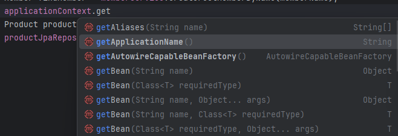

> ## Spring Bean이란?

Spring Bean은 Spring IoC 컨테이너가 생성하고 관리하는 객체를 의미한다. 개발자가 직접 new로 생성하는 것이 아니라
스프링 컨테이너에게 객체 생성과 관리에 대한 위임을 모두 넘기는 형태로 동작하여 개발자는 이 부분에 관해서 신경 쓰지 않아도 된다.

빈을 등록하는 방법은 @Component를 활용한 방법 혹은 @Bean을 활용한 방법이 있다.

- @Component : 직접 개발자가 작성한 코드에 대해서 스프링 컨테이너에 대해서 활용을 하고 싶을 때 활용
- @Bean : 직접 개발자가 작성하지는 않았지만 외부에서 끌어온 의존성의 경우 객체를 직접 컨테이너에 등록해서 사용하고 싶은 경우 활용한다.

```java
@Target({ElementType.TYPE})
@Retention(RetentionPolicy.RUNTIME)
@Documented
@Indexed
public @interface Component {
    String value() default "";
}

@Target({ElementType.METHOD, ElementType.ANNOTATION_TYPE})
@Retention(RetentionPolicy.RUNTIME)
@Documented
public @interface Bean {
    @AliasFor("name")
    String[] value() default {};

    @AliasFor("value")
    String[] name() default {};

    boolean autowireCandidate() default true;

    boolean defaultCandidate() default true;

    Bootstrap bootstrap() default Bean.Bootstrap.DEFAULT;

    String initMethod() default "";

    String destroyMethod() default "(inferred)";

    public static enum Bootstrap {
        DEFAULT,
        BACKGROUND;

        private Bootstrap() {
        }
    }
}
```

위의 Java 코드를 중 @Target 부분을 보면 @Component는 ElementType.TYPE으로 되어있고, 
@Bean은 ElementType.METHOD, ElementType.ANNOTATION_TYPE으로 되어있다.

각각 @Component는 클래스, 인터페이스 등의 레벨에 설정이 가능하고, @Bean은 메서드 레벨에 설정이 가능하다.

---

> ## Bean의 메타데이터

공식 문서상에 하단 데이터를 보면 스프링 컨테이너 내부에 등록된 빈들에 대한 메타데이터 종류가 어떤 종류가 있는 지를 확인할 수 있다.
이 정보가 중요한 이유는 컨테이너 내부에서 빈을 어떻게 찾을 수 있는 지를 이해할 수 있고, 언제 지연 초기화되고 빈 라이프 사이클과도 연관이 있기 때문이다.

| Property                | Explained in…​               |
|-------------------------|------------------------------|
| Class                   | Instantiating Beans          |
| Name                    | Naming Beans                 |
| Scope                   | Bean Scopes                  |
| Constructor arguments   | Dependency Injection         |
| Properties              | Dependency Injection         |
| Autowiring mode         | Autowiring Collaborators     |
| Lazy initialization mode| Lazy-initialized Beans       |
| Initialization method   | Initialization Callbacks     |
| Destruction method      | Destruction Callbacks        |

---

> ## Beandml Class, Name과 초기화 방식

우선 상단의 Class, Name 정보를 통해서는 어떻게 스프링 컨테이너 내부에서 등록된 빈을 찾아올 수 있다.

이는 스프링 컨테이너 인터페이스인 ApplicationContext 객체에서 찾아올 수 있으며 다음과 같이 해당 객체의 내부를 보면 어떻게 빈을 찾아올 수 있는 지
나와 있다. 클래스 정보부터 이름까지 다양한 방법으로 조회가 가능하다.



만약에 객체가 등록이 되면 다음과 같이 XML 파일에 특정 클래스 객체의 이름과 별칭을 지정해서 설정을 할 수 있다. 

```xml
<alias name="myApp-dataSource" alias="subsystemA-dataSource"/>
<alias name="myApp-dataSource" alias="subsystemB-dataSource"/>
```

그런데 우리는 일반적으로는 XML로 요즘엔 거의 지정을 하지 않는다. 그러면 자바 코드에서 의존관계에 어떤 클래스의 어떤 메서드를 활용하라는 정보는
어디서 가져올 수 있을까?

해당 정보는 원래는 다음과 같이 XML을 통해서 생성자 혹은 정적 팩토리 메서드 정보를 다음과 같이 XML에 등록함으로써 가져올 수 있었다.

```java
// 생성자 활용 방식
<bean id="exampleBean" class="examples.ExampleBean"/>
<bean name="anotherExample" class="examples.ExampleBeanTwo"/>
        
// 정적 팩토리 메서드 방식
<bean id="clientService"
      class="examples.ClientService"
      factory-method="createInstance"/>

// 인스턴스 팩토리 메서드 방식
<!-- the factory bean, which contains a method called createClientServiceInstance() -->
<bean id="serviceLocator" class="examples.DefaultServiceLocator">
	<!-- inject any dependencies required by this locator bean -->
</bean>

<!-- the bean to be created via the factory bean -->
<bean id="clientService"
factory-bean="serviceLocator"
factory-method="createClientServiceInstance"/>
```

이젠 위처럼 작성을 하지 않아도 Java 코드를 통해 위와 똑같은 효과를 내는 코드들을 작성할 수 있다. 각각의 정보들은 Java 코드와 XML 코드을
매칭해놓은 형태로 작성을 했다.

```java
// 생성자 호출 방식
@Configuration
public class AppConfig {
    @Bean
    public MyService myService() {
        return new MyService(); 
    }
}

// 정적 팩토리 메서드를 사용한 방법
public class ClientService {
    private static ClientService clientService = new ClientService();
    private ClientService() {}

    public static ClientService createInstance() {
        return clientService;
    }
}

// 인스턴스 메서드를 사용한 방법
public class DefaultServiceLocator {

    private static ClientService clientService = new ClientServiceImpl();

    public ClientService createClientServiceInstance() {
        return clientService;
    }
}
```

각각의 방식에서는 장단점이 있는데 아래와 같이 정리할 수 있다. 그나마 생성자 방식과 정적 팩토리 메서드 방식이 주로 사용된다.

- 생성자 방식 : 직관적인, 의존성 주입에 적합한 경우
- 정적 팩토리 메서드 방식 : 복잡한 생성 로직 캡슐화나 외부 라이브러리에 활용, 의존 관계를 명확하게 한 곳에서만 정의할 수 있다는 장점이 있음.

---

> ## Bean Scope 

빈 스코프에는 다양한 범위가 있지만 보통은 아래의 두 가지만 활용이 된다.

| Scope              | 	Description                                                                                         |
|-------------------------|------------------------------------------------------------------------------------------------------|
| singleton                | (Default) Scopes a single bean definition to a single object instance for each Spring IoC container. |
| prototype               | Scopes a single bean definition to any number of object instances.                                   |

- 싱글톤 범위(기본 설정)

  - 싱글톤 빈의 공유 인스턴스는 하나만 관리가 되며 싱글톤으로 빈을 정의하면 일치하는 ID를 가진 빈을 Spring IoC 컨테이너에서는 딱 한
  객체만 보유를 한다. 이는 인스턴스의 싱글턴 빈 캐시에 저장이 되고 해당 빈에 대해서 가져올 수 있다.

- 프로토타입 범위(별도 설정 필요)
  - 특정 빈에 대한 요청이 있을 때마다 새 빈 인스턴스를 생성한다. 이 때 프로토타입으로 지정된 빈은 생명주기 동안 Spring의 주기 관리를 받지 않는다.
초기화까지만 동작이 되고 이후에는 관리되지 않는다. 띠리서, 소멸 수명 주기 등의 콜백은 호출되지 않는다. 대신 빈 후처리기를 사용하면 이를 활용할 수 있다.

- 만약에 새 인스턴스를 반복적으로 가지고 오고 싶다면?
  - Method Injection을 활용해서 매번 새 인스턴스를 사용하고 싶을 때 사용할 수 있다. 보통은 로그 등에 이런 방법이 사용되지만 거의 사용되지 않는다.
  - 관심이 있다면 @Lookup, ObjectFactory, Provider 등을 찾아보자.

---

> ## 빈 후처리기 

빈의 초기화 이전 혹은 이후에 어떤 작업을 추가적으로 해야 하는 지, 각각의 요소 별로 종속성에 있어서 순서가 존재할 때 이를 도와주는 콜백 메서드를
정의할 수 있는 인터페이스이다. 여러 인스턴스를 구성하고 @Order 등을 통해 순서를 제어할 수 있다는 특징도 있다.

```java
public interface BeanPostProcessor {
    Object postProcessBeforeInitialization(Object bean, String beanName);
    Object postProcessAfterInitialization(Object bean, String beanName);
}
```

보통 빈 등록 과정은 다음과 같다.

- 1. 생성 : 스프링 빈 대상 객체를 생성한다(@Bean 혹은 컴포넌트 스캔 모두 포함)
- 2. 전달 : 생성된 객체를 빈 저장소에 등록하기 직전에 빈 후처리기에 전달
- 3. 후 처리 : 빈 후처리기는 객체를 조작하거나 다른 객체로 바꿔치기 가능
- 4. 등록 : 빈 후처리기는 빈을 반환한다.

아래 식으로 BeanPostProcessor 인터페이스를 상속 받아 두 메서드 중 하나만 작성 시 이전 과정 혹은 이후 과정에 처리가 된다.
이 과정은 Spring AOP에서도 비슷한 방식으로 동작하며 간단하게 빈 초기화 과정에서 프록시로 감싸는 등의 처리가 된다.

```java
public class InstantiationTracingBeanPostProcessor implements BeanPostProcessor {

	// simply return the instantiated bean as-is
	public Object postProcessBeforeInitialization(Object bean, String beanName) {
		return bean; // we could potentially return any object reference here...
	}

	public Object postProcessAfterInitialization(Object bean, String beanName) {
		System.out.println("Bean '" + beanName + "' created : " + bean.toString());
		return bean;
	}
}
```

만약에 위와 다르게 빈 생성 이전 혹은 스프링이 빈이 생성될 때에는 각각 아래의 인터페이스를 활용하는 방법도 존재한다.

- BeanFactoryPostProcessor : 빈 생성 이전 설정 값 수정, 프로퍼티 외부화
- FactoryBean : 빈 생성 시 복잡한 생성 로직을 캡슐화

---

> ## 빈 라이프사이클

스프링 빈의 생명 주기는 다음과 같이 아래의 이미지로 설명을 할 수 있다. 여기에서 스프링에서 지원하는 콜백은 "초기화 콜백 메서드 호출"과
"소멸 전 콜백 메서드 호출" 부분이 있다.


여기에서 초기화 콜백과 소멸 전 콜백을 호출하는 방법에는 총 3가지가 방법이 있다.

- InitializingBean과 DisposableBean 인터페이스를 구현하는 방법 : 스프링 코드와 결합이 강하다.
- 설정 정보에 초기화 메소드, 종료 메소드 지정 : 아래처럼 코드를 등록하는 게 매우 번거롭다.

```java
public class DefaultBlogService implements BlogService {

  private BlogDao blogDao;

  public void setBlogDao(BlogDao blogDao) {
    this.blogDao = blogDao;
  }

  // this is (unsurprisingly) the initialization callback method
  public void init() {
    if (this.blogDao == null) {
      throw new IllegalStateException("The [blogDao] property must be set.");
    }
  }
}

// XML 부분
<beans default-init-method="init">

	<bean id="blogService" class="com.something.DefaultBlogService">
		<property name="blogDao" ref="blogDao" />
	</bean>

</beans>
```

- @PostConstruct, @PreDestroy를 활용한 방법 : JSR-250 스펙이라 스프링이 아니어도 나중에 활용이 가능함.

그런데 아래의 방법이 가장 좋은 거냐? 어떤 걸 주의해야 되냐?라고 이야기를 하면 아래와 같은 부분을 좀 조심해야 함.

- 스프링 서버의 강제 종료가 될 때에 해당 코드가 동작하지 않으면 어떤 문제가 발생할 지 모름
- 추가적으로 해당 코드가 잘못된 경우 빈이 제대로 동작 안할 수 있음.(이건 당연한 거 아닌가??)
- 외부 라이브러리에서는 위에서 언급한 것처럼 XML방식으로 해야 되는데 
이 경우엔 @PostConstruct, @PreDestory를 작성할 수 없으므로 @Bean의 initMethod 혹은 destroyMethod를 통해서 초기화 메서드를
지정해서 활용이 가능함.