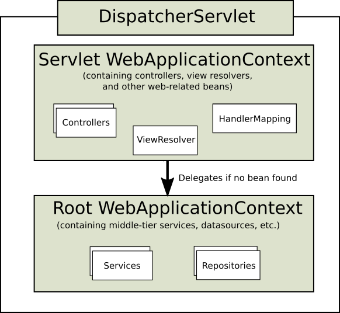
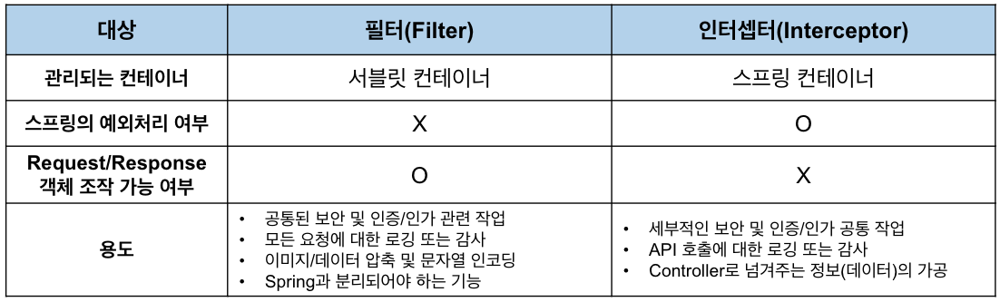
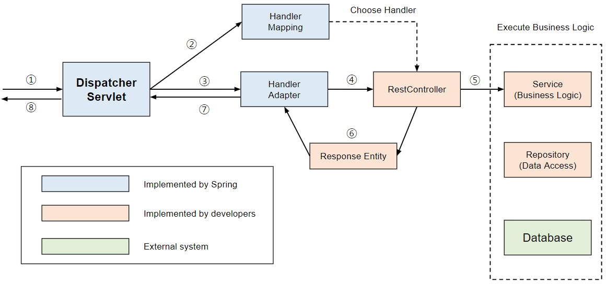

# Spring Web MVC

Spring Web MVC는 Servlet API를 기반으로 구축된 웹 프레임워크로, Spring Framework에 포함된다.
Spring Web MVC는 해당 소스 모듈(spring-webmvc)의 이름에서 유래하지만 일반적으로 "Spring MVC"로 알려져 있다.

Spring Web MVC는 **서블릿 필터 → DispatcherServlet → 인터셉터 → 핸들러 실행(동기/비동기) → 메시지·뷰 변환 → 응답 반환**의 흐름으로 HTTP 요청을 처리한다.

---

## 1. DispatcherServlet (Front Controller)

Spring MVC의 **Front Controller** 역할을 맡는 `DispatcherServlet`은 모든 HTTP 요청을 중앙에서 받아, 각 단계(매핑, 실행, 예외 처리, 뷰 렌더링 등)에 위임한다.

### 1.1 Context Hierarchy

DispatcherServlet은 **Servlet 전용** WebApplicationContext를 사용하며, 필요 시 **루트** WebApplicationContext를 부모로 하는 계층 구조를 구성할 수 있다.

- **Root WebApplicationContext**  
  공통 비즈니스 빈(Service, Repository 등)을 여러 서블릿에서 공유한다
- **Servlet WebApplicationContext**  
  각 `DispatcherServlet`별로 컨트롤러·뷰 리졸버·인터셉터 등 웹 전용 빈을 독립 관리한다

> **장점:** 공통 빈 중복을 줄이고, 서블릿별 독립 구성으로 모듈화를 강화한다



### 1.2 Initialization & Config

- **등록**: `web.xml` / `WebApplicationInitializer` / Spring Boot 자동 구성
- **Servlet Config (`init-param`)**
  - `contextConfigLocation`, `namespace`로 설정 위치를 지정한다
  - `loadOnStartup`, `asyncSupported`로 로드 순서·비동기 지원 여부를 제어한다
  - `throwExceptionIfNoHandlerFound`, `dispatchOptionsRequest` 등 예외·옵션 제어 파라미터를 지정한다
- **Web MVC Config**
  - `<mvc:annotation-driven>` / `@EnableWebMvc`
    - 메시지 컨버터, 핸들러 매핑, 검증기, 포맷터, `ConversionService` 등을 자동 등록한다
    - `ContentNegotiationConfigurer`로 컨텐츠 협상 전략을 정의할 수 있다
    - `WebMvcConfigurer`로 메시지 컨버터 교체·추가, 인터셉터 등록, 리소스 핸들러 설정 등을 확장할 수 있다
- **Strategy Registration**
  - `DispatcherServlet.properties`에 명시된 기본 전략 빈을 로드하며, 동일 타입의 사용자 빈이 있으면 이를 대체한다
  - `initStrategies(context)` 호출 시 다음 순서로 전략을 초기화한다:
    1. HandlerMapping
    2. HandlerAdapter
    3. HandlerExceptionResolver
    4. ViewResolver

### 1.3 Special Bean Types

`DispatcherServlet`이 자동 탐지·등록하거나 기본 구현체를 제공하는 전략 컴포넌트:

| 컴포넌트                               | 역할                                                                                        |
| -------------------------------------- | ------------------------------------------------------------------------------------------- |
| **HandlerMapping**                     | URL·메서드·파라미터·헤더 조건에 맞춰 컨트롤러 메서드를 결정한다                             |
| **HandlerAdapter**                     | 선택된 핸들러를 실행하고, 메서드 인자 바인딩 → 반환값(`ModelAndView`/`ResponseEntity`) 처리 |
| **HandlerExceptionResolver**           | 예외 발생 시 `@ExceptionHandler`, `@ControllerAdvice`, 기본 리졸버 체인으로 처리한다        |
| **ViewResolver**                       | 논리 뷰 이름을 실제 뷰 구현체(JSP/Thymeleaf 등)로 변환한다                                  |
| **LocaleResolver** / **ThemeResolver** | 다국어·테마 결정 및 `LocaleChangeInterceptor`/`ThemeChangeInterceptor`와 연동한다           |
| **MultipartResolver**                  | `multipart/form-data` 요청을 파싱해 `MultipartFile`로 바인딩한다                            |
| **FlashMapManager**                    | 리다이렉트 시 플래시 속성(일회용 메시지)을 저장·전달한다                                    |

---

## 2. 서블릿 필터 체인 (Pre-processing)

`DispatcherServlet` 진입 전 **서블릿 컨테이너 레벨**에서 **Cross-cutting Concern**(폼 데이터 파싱, 프록시 헤더, 캐싱, CORS, URL 정규화 등)을 처리한다.
각 Filter는 `javax.servlet.Filter` 인터페이스를 구현(implements)해야 하며, 다음 세 가지 메서드를 가진다:

1. **init(FilterConfig)**

   - 필터 객체를 초기화하고, 설정 파라미터를 읽어 준비 작업을 수행한다.
   - 웹 컨테이너가 애플리케이션 시작 시 딱 한 번 호출한다.

2. **doFilter(ServletRequest, ServletResponse, FilterChain)**

   - 지정된 URL 패턴에 맞는 모든 요청에 대해 호출된다.
   - `chain.doFilter(request, response)` 전후에 필요한 전·후처리 로직을 삽입할 수 있다.
   - 디스패처 서블릿으로 넘어가기 전, 또는 응답 반환 후 추가 작업을 할 때 사용한다.

3. **destroy()**
   - 필터 객체를 제거하기 전, 사용하던 리소스를 정리(반환)한다.
   - 웹 컨테이너가 애플리케이션 종료 시 딱 한 번 호출한다.

> 출처: [[Spring] 필터(Filter) vs 인터셉터(Interceptor) 차이 및 용도 - (1)](https://mangkyu.tistory.com/173)

- **FormContentFilter**  
  PUT/PATCH/DELETE 본문(form-urlencoded) 파라미터를 `getParameter()`로 읽을 수 있도록 래핑한다. RESTful 폼 데이터 접근 일관성을 제공한다.

- **ForwardedHeaderFilter**  
  `X-Forwarded-*`/`Forwarded` 헤더를 반영해 원본 호스트·포트·스킴 정보를 보존한다. 프록시 환경에서 올바른 URL 생성에 필수적이다.

- **ShallowEtagHeaderFilter**  
  응답 바디를 해시해 ETag를 생성하고, `If-None-Match`와 비교해 304 Not Modified를 반환한다. 네트워크와 서버 부하를 줄인다.

- **CorsFilter**  
  전역 CORS 헤더를 설정해 SPA나 외부 도메인의 AJAX 요청을 허용한다. 브라우저 차단을 방지한다.

- **UrlHandlerFilter**  
  후행 슬래시를 리다이렉트(308)하거나 래핑해 URL 일관성을 유지한다. 슬래시 유무로 인한 404를 방지한다.

---

## 3. 인터셉터 (HandlerInterceptor)

`DispatcherServlet` 단계에서 **핸들러 전·후**에 동작하는 훅을 제공한다.

- **preHandle(request, response, handler)**  
  컨트롤러 실행 전 공통 처리(인증·로깅 등). `false` 반환 시 이후 단계가 건너뛴다
- **postHandle(request, response, handler, modelAndView)**  
  핸들러 실행 후 뷰 렌더링 전 모델·뷰를 보강한다
- **afterCompletion(request, response, handler, ex)**  
  뷰 렌더링 완료 후 리소스를 정리하고 예외를 로깅한다

> 인터셉터는 **오직 `DispatcherServlet`이 매핑한 요청**에만 적용된다.  
> 등록은 `WebMvcConfigurer.addInterceptors()`로 순서를 제어한다.

### Filter vs. Interceptor



- **Filter**는 서블릿 레벨에서 모든 요청을 처리하므로 Spring MVC 외부의 요청·응답도 제어할 수 있다.
- **Interceptor**는 `DispatcherServlet`이 매핑한 핸들러에 한정되어 동작하며, Spring MVC 내부의 컨트롤러 호출 전후에만 개입할 수 있다.
- 따라서 **인증·인가, 트랜잭션 관리**처럼 Spring 컨텍스트와 밀접한 로직은 인터셉터에서,**인코딩, 공통 헤더, CORS, 캐싱, 로깅**처럼 서블릿 필터 단계에서 처리해야 할 로직은 Filter에서 구현하는 것이 좋다.

---

## 4. 핸들러 실행 & 데이터 변환

### 4.1 Processing Sequence



`DispatcherServlet`이 클라이언트 요청을 처리하는 단계별 순서:

1. **서블릿 필터(Pre)**
2. **DispatcherServlet 진입**
   - `WebApplicationContext` 바인딩
   - `asyncSupported` 속성으로 비동기 요청 여부 확인
3. **HandlerMapping**
   - URL·HTTP 메서드·헤더·파라미터 조건으로 핸들러 검색
4. **Interceptor preHandle**
   - `HandlerInterceptor.preHandle()` 호출
   - `false` 반환 시 이후 단계 건너뜀
5. **HandlerAdapter 실행 & 리턴 처리**
   - **동기 흐름**:
     - 아규먼트 리졸버(`@RequestParam`, `@PathVariable`, `@RequestBody` 등)로 메서드 인자 바인딩
     - 컨트롤러 메서드 호출
     - 리턴값(`ModelAndView`, 뷰 이름, `@ResponseBody`, `ResponseEntity`)을 기반으로 후속 처리
   - **비동기 흐름**:
     - 반환 타입이 `Callable`, `DeferredResult`, `WebAsyncTask`인 경우
     - 초기 스레드를 즉시 해제하고, 백그라운드에서 작업 수행 후 결과 재개
6. **Interceptor postHandle**
   - `postHandle()`로 `ModelAndView`나 응답 헤더 추가 조작
7. **ExceptionResolver**
   - 컨트롤러 혹은 인터셉터 단계 예외 발생 시
   - `@ExceptionHandler`, 글로벌 `@ControllerAdvice`, 기본 리졸버 체인으로 분기 처리
8. **ViewResolver & Rendering / HttpMessageConverter**
   - **뷰 응답**: `ViewResolver` 체인으로 JSP/Thymeleaf 등 뷰 구현체 탐색 후 렌더링
   - **REST 응답**: `HttpMessageConverter` 체인으로 본문 직렬화(`JSON`, `XML`, `텍스트`, `바이너리` 등)
9. **Interceptor afterCompletion**
   - `afterCompletion()`에서 리소스 정리, 로깅, 트랜잭션 마무리
10. **서블릿 필터(Post)**

### 4.2 HTTP Message Conversion

Spring MVC의 **HTTP Message Conversion**은 `HttpMessageConverter` 전략 인터페이스를 통해 HTTP 요청·응답 본문의 데이터를 Java 객체로 **읽고 쓰는** 기능을 제공한다. 이 메커니즘은 **클라이언트(RestClient, RestTemplate)**와 **서버(@RequestBody/@ResponseBody)** 양쪽에서 사용되며, 다양한 미디어 타입(JSON, XML, 텍스트, 바이너리, Protobuf 등)에 대해 별도 파싱 로직 없이 일관된 변환을 지원한다.

- **역할**
  - HTTP 본문(InputStream/OutputStream) ↔ Java 객체 매핑 추상화
  - `canRead`/`canWrite`로 지원 여부 판단
  - `getSupportedMediaTypes`로 처리 가능한 미디어 타입 제공
  - `read()`/`write()`로 본문 파싱·직렬화 수행
- **주요 구현체**:
  - `StringHttpMessageConverter` (문자열↔`text/*`)
  - `ByteArrayHttpMessageConverter` (`byte[]`↔`application/octet-stream`)
  - `FormHttpMessageConverter` (`application/x-www-form-urlencoded`, `multipart/form-data`)
  - `MarshallingHttpMessageConverter`, `SourceHttpMessageConverter` (XML)
  - `MappingJackson2HttpMessageConverter`, `GsonHttpMessageConverter`, `JsonbHttpMessageConverter` (JSON)
  - `ProtobufHttpMessageConverter`, `ProtobufJsonFormatHttpMessageConverter` (Protobuf)

### 4.3 URI Links

Spring MVC는 컨트롤러와 뷰 내에서 안전하고 일관된 URI를 생성하기 위한 **URI 빌딩 메커니즘**을 제공한다.

- **UriComponentsBuilder**
  - URI 템플릿(`/{var}`)에 변수 바인딩
  - 쿼리 파라미터·경로 조립
- **ServletUriComponentsBuilder**
  - 현재 요청의 스킴·호스트·포트·컨텍스트 경로를 기반으로 상대 URI 생성
- **MvcUriComponentsBuilder**
  - `@RequestMapping` 메서드 참조(`fromMethodName`, `fromMethodCall`)로 URI 생성
- **인코딩 모드**: TEMPLATE_AND_VALUES, VALUES_ONLY, URI_COMPONENT, NONE
- **프록시 대응**: `X-Forwarded-*` 헤더 기반 베이스 URL 보정

---

## 5. 엔드포인트 구현 모델

Spring MVC는 **애노테이션 기반**과 **함수형** 두 가지 방식으로 엔드포인트를 구현할 수 있다.  
각 모델은 요청 매핑, 입력 바인딩, 반환 처리, 검증·예외 처리 등을 체계적으로 지원해 개발 생산성과 유지보수성을 높인다.

---

### 5.1 Annotated Controllers

애노테이션 기반 컨트롤러는 메서드 단위로 요청 처리 로직을 선언적으로 구성한다.  
XML 설정 없이도 URL 매핑부터 검증·예외 처리까지 한눈에 파악 가능하다.

- **선언 및 매핑**

  - `@Controller` : 컴포넌트 스캔 시 컨트롤러로 등록한다.
  - `@RestController` : `@Controller` + `@ResponseBody` 조합, 반환값을 자동으로 HTTP 본문에 직렬화한다.
  - `@RequestMapping`, `@GetMapping` 등 : URL 패턴·HTTP 메서드·미디어타입 등을 지정해 요청을 매핑한다.

- **메서드 인자 바인딩**

  - `@RequestParam` : 쿼리스트링/폼 필드 파라미터 바인딩
  - `@PathVariable` : 경로 템플릿(`/{id}`) 변수 바인딩
  - `@RequestBody` : JSON/XML 본문을 Java 객체로 역직렬화
  - `@ModelAttribute` : 폼 데이터 바인딩 후 모델에 자동 추가
  - `@RequestHeader`, `@CookieValue`, `@RequestAttribute` 등 : 헤더·쿠키·요청 속성 주입

- **반환 값 처리**

  - `String` : 뷰 이름으로 해석, `ViewResolver`가 실제 뷰를 렌더링
  - `ModelAndView` : 뷰 이름과 모델 데이터를 함께 반환
  - `@ResponseBody` / `ResponseEntity<T>` : 메시지 컨버터를 통해 REST 응답 본문 및 상태·헤더 제어

- **검증 & 바인딩**

  - `@InitBinder` : 커스텀 에디터·포맷터·검증기 등록
  - `@Valid` / `@Validated` + `BindingResult` : JSR-303 검증 실행 및 오류 처리

- **예외 처리**

  - `@ExceptionHandler` : 해당 컨트롤러 범위 내 예외 처리
  - `@ControllerAdvice` : 전역 예외 처리, 공통 모델 속성·바인딩 설정

- **모델 & 세션**
  - `Model`, `ModelMap`, `Map<String,Object>` : 뷰에 전달할 데이터를 key-value로 추가
  - `@SessionAttributes` / `@SessionAttribute` : 모델 속성의 세션 유지·조회

---

### 5.2 Functional Endpoints

함수형 프로그래밍 모델은 **람다**와 **불변 객체** 기반 DSL로 라우팅과 핸들러를 정의한다.  
코드로 직접 “어떤 요청이 들어오면 어떤 함수가 처리할지”를 명시적으로 구성할 수 있다.

- **핸들러 함수 (HandlerFunction)**

  - 시그니처: `ServerRequest` → `ServerResponse`
  - 순수 함수 형태로, 애노테이션 기반 메서드와 동일한 역할 수행

- **라우터 함수 (RouterFunction)**

  - 시그니처: `ServerRequest` → `Optional<HandlerFunction>`
  - 요청 조건 매칭(`RequestPredicate`) 시 핸들러 함수 반환

- **RequestPredicates**

  - `GET("/items")`, `path("/users/{id}")`, `accept(MediaType.APPLICATION_JSON)` 등
  - `and()`, `or()`, `negate()`로 복합 조건 정의

- **중첩 라우팅 (nest)**

  ```java
  RouterFunctions
    .nest(RequestPredicates.path("/api"),
      RouterFunctions.route(GET("/items"), handler::list)
                     .andRoute(POST("/items"), handler::create)
    );
  ```

  - 공통 경로나 미디어 타입을 하나의 그룹으로 묶어, 중복 규칙을 제거하고 가독성을 높인다

- **필터링 (before / after)**

  - 요청 전·후에 적용할 공통 로직(인증, 로깅, 트랜잭션 등)을 체인 형태로 삽입
  - Spring Security CORS 정책 등, 필터 레벨보다 세밀한 제어가 가능하다

- **정적 자원 매핑**

  - 리소스 핸들러를 통해 URL 패턴과 정적 파일 위치를 연결
  - SPA 인덱스 리다이렉트, 클래스패스·파일시스템 리소스 지원

- **동시 등록 지원**
  - 애노테이션 기반 컨트롤러와 함수형 엔드포인트를 함께 사용할 수 있어,  
    기존 코드와 점진적 마이그레이션이 가능하다

> **의의:** 함수형 모델은 애노테이션 방식을 보완하며, 특히 라우팅 로직·행동 제어·테스트 용이성 측면에서 유연성을 높인다.

---

## 6. 비동기 지원 (Asynchronous Requests)

Spring MVC는 Servlet 3.0+ 비동기 API를 활용해 **긴 처리 작업**에서 스레드를 해제·재사용하고, **스트리밍**이나 **SSE**를 효율적으로 처리할 수 있도록 지원한다.

- **Callable / DeferredResult / WebAsyncTask**
  - 컨트롤러가 이들 타입을 반환하면 즉시 스레드를 반환하고, 결과 준비 시 자동으로 응답을 재개한다.
- **StreamingResponseBody / SseEmitter**
  - `OutputStream` 스트리밍이나 Server-Sent Events 방식으로 대용량 데이터를 전송한다.
- **설정**
  - Java: `WebMvcConfigurer.configureAsyncSupport()`
  - XML: `<mvc:async-support default-timeout="…"/>`
  - Boot: `spring.mvc.async.request-timeout=…`

이로써 장시간 작업이나 실시간 이벤트 전송 시에도 스레드 풀 고갈 없이 안정적인 처리가 가능하다.
