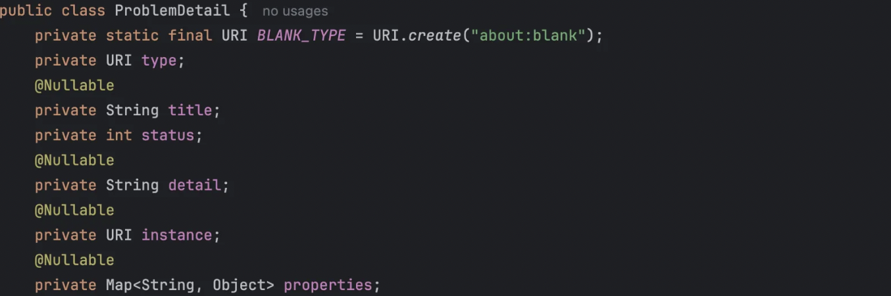
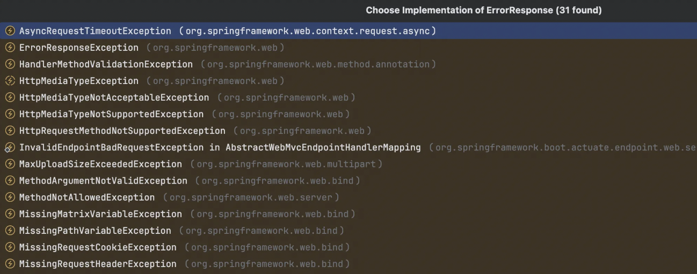
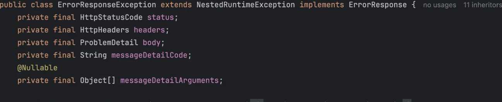
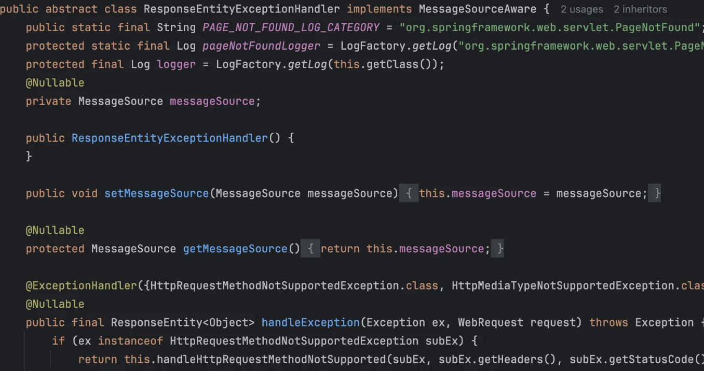
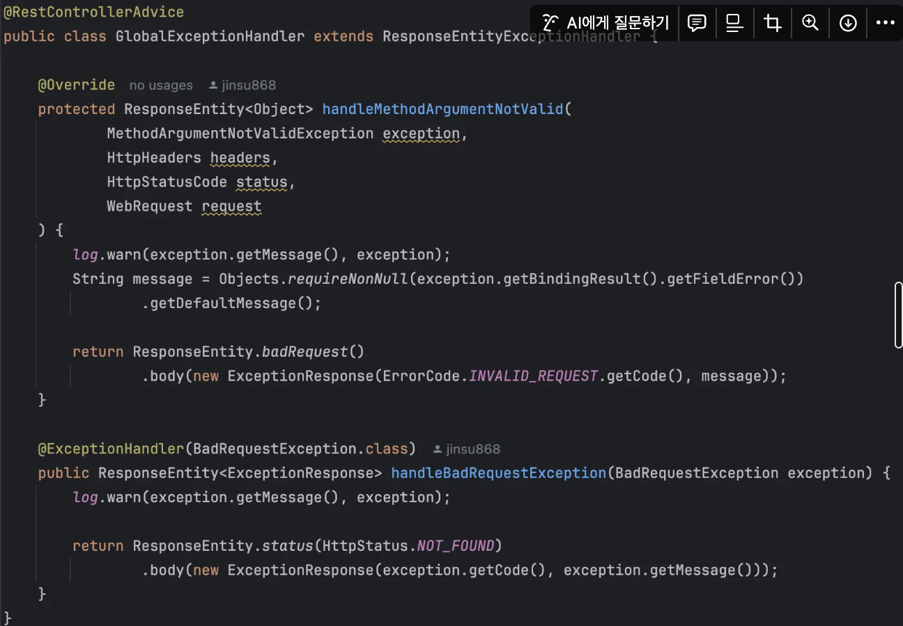
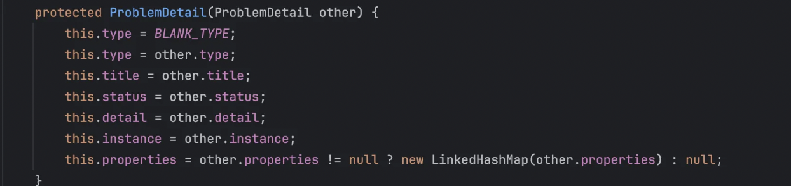
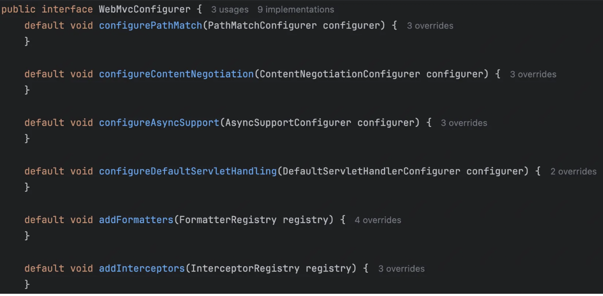

## CORS

- 보안상의 이유로 브라우저는 외부 리소스에 대한 AJAX 요청을 금지한다.
  - 예를 들어 evil.com과 은행 계좌가 각각 다른 탭에 떠있다면 evil.com의 스크립트가 은행 사용자 인증 정보를 사용해서 은행 API에 AJAX 요청을 보내는 것을 막는다.
- CORS의 경우 대부분의 브라우저에 구현된 W3C 사양이다.
  - 직접 어떤 종류의 cross-domain 요청을 허용할지 설정할 수 있다.


## Credentialed Request

- `allowedCredentials` 를 활성화시켜 사용할 수 있다.
- 이 옵션의 경우 설정된 도메인과 높은 수준의 신뢰 관계를 구축하고 민감한 사용자별 정보를 노출시켜 공격 범위를 넓힌다.
  - 예를들어 민감한 사용자 정보에는 CSRF 토큰이나 쿠키 등이 있다.
- `allowOrigins`에서 와일드카드는 허용되지 않는다. 대신 `allowOriginPatterns`설정이 동적인 origin 집합들과 매치될 수 있다.


## Processing

- CORS 스펙은 preflight, simple, actual 요청을 구분한다.

- Spring MVC의 HandlerMapping은 기본적으로 CORS를 지원한다.

- 요청이 성공적으로 핸들러에 매핑되면 HanderMapping은 CORS 설정을 확인하고 처리한다.

- simple, actual request는 중간에 가로채져서 검증되어 CORS 응답 헤더에 설정되는데 preflight의 경우 바로 처리된다.

- CORS 요청을 허용하려면 명시적인 CORS 설정이 필요하다.

  - 매칭되는 CORS 설정이 존재하지 않으면 preflight 요청은 거절된다.

- 각 HandlerMapping은 URL 패턴 기반 설정 매핑을 통해 개별적으로 설정될 수 있다.

  - 전역 CORS 설정과 핸들러 레벨의 CORS 설정이 가능하다.

  1. @CrossOrigin 애노테이션 사용
  2. CorsConfigurationSource 구현 방식

- 전역 설정과 로컬 설정이 충돌하면 로컬 설정이 덮어쓴다.


## @CrossOrigin

```java
@RestController
@RequestMapping("/account")
public class AccountController {

	@CrossOrigin
	@GetMapping("/{id}")
	public Account retrieve(@PathVariable Long id) {
		// ...
	}

	@DeleteMapping("/{id}")
	public void remove(@PathVariable Long id) {
		// ...
	}
}

//--------------------------------------------------------

@CrossOrigin(origins = "<https://domain2.com>", maxAge = 3600)
@RestController
@RequestMapping("/account")
public class AccountController {

	@GetMapping("/{id}")
	public Account retrieve(@PathVariable Long id) {
		// ...
	}

	@DeleteMapping("/{id}")
	public void remove(@PathVariable Long id) {
		// ...
	}
}

//-------------------------------------------------------

@CrossOrigin(maxAge = 3600)
@RestController
@RequestMapping("/account")
public class AccountController {

	@CrossOrigin("<https://domain2.com>")
	@GetMapping("/{id}")
	public Account retrieve(@PathVariable Long id) {
		// ...
	}

	@DeleteMapping("/{id}")
	public void remove(@PathVariable Long id) {
		// ...
	}
}
```

- 기본적으로 All origins, All Headers, All HTTP Method가 허용된다.
- allowCredentials는 기본으로 설정되진 않는다.
  - 민감한 유저 정보를 노출하기 때문에 (CSRF, Cookie)
  - allowOrigins를 설정하면 반드시 하나 이상의 도메인을 설정해야 한다. (*제외)
  - allowOriginPatterns를 사용하여 동적으로 origins 집합을 매칭시킬 수 있다.
- 메서드 레벨, 클래스 레벨 다 사용할 수 있다.


## Global Configuration

- HandlerMapping에 URL기반의 CorsConfiguration 매핑을 설정할 수 있다.
- 대부분의 MVC 애플리케이션은 MVC Java Configuration이나 MVC XML namespace를 사용해서 설정한다.
- 기본적으로 All origins, All Headers, / GET, HEAD, 그리고 POST 메서드를 지원한다.
- allowCredentials는 기본적으로 설정되지 않는다.


## Java Configuration

```java
@Configuration
@EnableWebMvc
public class WebConfig implements WebMvcConfigurer {

	@Override
	public void addCorsMappings(CorsRegistry registry) {

		registry.addMapping("/api/**")
			.allowedOrigins("<https://domain2.com>")
			.allowedMethods("PUT", "DELETE")
			.allowedHeaders("header1", "header2", "header3")
			.exposedHeaders("header1", "header2")
			.allowCredentials(true).maxAge(3600);

		// Add more mappings...
	}
}
```

## CORS Filter

```java
CorsConfiguration config = new CorsConfiguration();

// Possibly...
// config.applyPermitDefaultValues()

config.setAllowCredentials(true);
config.addAllowedOrigin("<https://domain1.com>");
config.addAllowedHeader("*");
config.addAllowedMethod("*");

UrlBasedCorsConfigurationSource source = new UrlBasedCorsConfigurationSource();
source.registerCorsConfiguration("/**", config);

CorsFilter filter = new CorsFilter(source);
```

- Spring Security를 사용 (Security에 기본으로 내장하고 있음.)
- 위와 같이 CorsCOnfigurationSource를 CorsFilter 생성자에 넘겨주면 된다.


------

## Error Responses

- REST 서비스의 일반적인 요구사항은 오류 응답 Body에 세부 정보를 포함하는 것이다.

- Spring 프레임워크는 RFC 9457에 있는 HTTP APIs를 위한 Problem Detail을 제공한다.

- ProblemDetail

  - RFC 9457에 나오는 problem detail을 표현하는 간단한 컨테이너이다.

  

- ErrorResponse

  - HTTP 에러 응답 상세 정보를 캡슐화하는 인터페이스이다.

    - status, response headers, body 등

  - Spring MVC에 기본으로 들어있는 대부분의 예외는 ErrorResponse를 구현하고 있다.

    

- ErrorResponseException

  - ErrorResponse를 구현한 base class로 간편하게 가져다 사용할 수 있다.

    

- ResponseEntityExceptionHandler

  - @ControllerAdvice 기반의 편리한 예외 처리를 할 수 있는 base class
  - Spring MVC에서 발생하는 표준 예외를 잡아서 ErrorResponse로 변환하고 적절한 HTTP 응답을 내려준다.

  

  - 대략 위와 같이 생겼고 우리는 이를 확장해서 사용할 수 있다.

    

### Render

- 어떤 @ExceptionHandler 또는 @RequestMapping 메서드에서 RFC 9457 응답을 내리기 위해 ProblemDetail이나 ErrorResponse를 리턴할 수 있다.
  - ProblemDetail의 HTTP status 설정이 최종 HTTP status를 결정한다.
  - ProblemDetail의 Instance 설정이 비어 있으면 현재 요청된 URL 경로로 자동 세팅된다.
  - Content Negotiation
    - Jackson HttpMessageConverter는 application/problem+json을 선호하고 그 다음 application/json을 비교해서 호환 타입을 찾는다.
  - 만약 다 없으면 application/problem+json으로 응답 body를 내려준다.
- ResponseEntityExceptionHandler를 extend해서 @ControllerAdvice로 선언하면 Spring MVC 예외 및 ErrorResponseException에 대한 응답을 활성화할 수 있다.
- 핸들러에 모든 내장 웹 예외를 포함하는 ErrorResponse 예외를 처리하는 @ExceptionHandler 메소드가 있다.
- 더 많은 예외 핸들링 메서드를 추가하거나 ProblemDetail에 매핑된 Protected method를 사용할 수도 있다.

### **Non-Standard Fields**

- RFC 9457 response를 확장해서 비표준 필드를 추가해서 넣을 수 있다.

  - ProblemDetail의 속성 맵에 추가하는 방법이 있다. (위 사진에 있는 properties)

  - ProblemDetail을 확장하여 전용 비표준 속성을 추가할 수 있다.

    - 복사 생성자를 사용하여 ProblemDetail의 하위 클래스를 쉽게 생성 가능하다.

      

  - 즉 @ControllerAdvice 안에서 ResponseEntityExceptionHandler를 확장해서 스프링이 만든 ProblemDetail을 하위 클래스로 다시 생성하고 추가 필드를 추가하면 애플리케이션 전체에서 일관된 에러를 제공할 수 있다.

------

## Security

Spring MVC와 Spring Security가 상호작용하면서 동작한다. Spring Security 부분은 나중에 회사에서 필요할 때 공부하는게 맞는듯.. 내용이 너무 방대하고 필요한 부분을 발췌하기 어려워서 나중에 개별적으로 학습..

(CSRF에 대해서는 알고 있어야 하기 때문에 이 부분에 대한 설명만 추가)

### CSRF 공격이란?

가장 쉽게 CSRF를 이해하는 방법은 예시를 보는 것.

```html
<form method="post"
	action="/transfer">
<input type="text"
	name="amount"/>
<input type="text"
	name="routingNumber"/>
<input type="text"
	name="account"/>
<input type="submit"
	value="Transfer"/>
</form>
```

은행 사이트에 위와 같은 HTML이 있다고 하자. 요청을 하면 아래와 같은 HTTP 요청이 나간다.

```html
POST /transfer HTTP/1.1
Host: bank.example.com
Cookie: JSESSIONID=randomid
Content-Type: application/x-www-form-urlencoded

amount=100.00&routingNumber=1234&account=9876
```

이 상태에서 로그아웃을 하지 않고 evil 웹사이트에 접속한다고 생각해보자.

```html
<form method="post"
	action="<https://bank.example.com/transfer>">
<input type="hidden"
	name="amount"
	value="100.00"/>
<input type="hidden"
	name="routingNumber"
	value="evilsRoutingNumber"/>
<input type="hidden"
	name="account"
	value="evilsAccountNumber"/>
<input type="submit"
	value="Win Money!"/>
</form>
```

그리고 해당 사이트에는 위와 같은 HTML이 포함된다.

공격자는 사용자의 쿠키를 볼 수는 없지만 요청에는 포함되어 보내지기 때문에 의도하지 않게 돈이 나갈 수 있다. 그리고 위 예시에는 클릭을 눌러야 하지만 자동으로 이체되도록 할 수도 있다.

## Protecting Against CSRF Attacks

- CSRF가 가능한 이유는 공격자 사이트와 일반(희생자) 사이트의 요청이 완전 동일하기 때문이다.
- 때문에 evil 사이트가 제공할 수 없는 것을 요청에 포함시켜야 한다.

→ Spring 에서는 CSRF를 막기 위해 2가지 메커니즘을 제공한다.

주의) GET/HEAD/OPTIONS/TRACE 같은 Safe HTTP method(서버의 상태를 변경하지 않는 요청)에 대해서는 CSRF 방어 메커니즘이 동작하지 않기 때문에 반드시 해당 요청들은 서버의 상태를 변경하지 않도록 설계해야 한다

1. Synchronizer Token Pattern
   - HTTP 요청에 CSRF Token(랜덤으로 생성된 값)이 포함된다.
   - 서버에서는 이게 서버에 있는 값과 동일한지 확인하고 다르면 요청을 거부한다.

```html
<form method="post"
	action="/transfer">
<input type="hidden"
	name="_csrf"
	value="4bfd1575-3ad1-4d21-96c7-4ef2d9f86721"/>
<input type="text"
	name="amount"/>
<input type="text"
	name="routingNumber"/>
<input type="hidden"
	name="account"/>
<input type="submit"
	value="Transfer"/>
</form>
```

**request form**

```html
POST /transfer HTTP/1.1
Host: bank.example.com
Cookie: JSESSIONID=randomid
Content-Type: application/x-www-form-urlencoded

amount=100.00&routingNumber=1234&account=9876&_csrf=4bfd1575-3ad1-4d21-96c7-4ef2d9f86721
```

- same origin policy 때문에 evil.com에서는 응답을 읽을 수 없다.
- 추후 _csrf token을 저장된 값과 비교해서 같은지 확인함으로써 [evil.com](http://evil.com) 사이트의 요청은 거부된다.

1. **SameSite Attribute**

```markdown
Set-Cookie: JSESSIONID=randomid; Domain=bank.example.com; Secure; HttpOnly; SameSite=Lax
```

- 위와 같이 SameSite 설정을 통해 CSRF 공격을 막을 수도 있다.

  - 쿠키를 설정할 때 SmaeSite 설정을 해줌으로써 외부 사이트에서 해당 쿠키를 사용할 수 없도록 강제한다.

- **동일 출처** 요청에는 항상 쿠키 첨부 (`Strict`와 같음)

- **교차 출처** 요청 중에서도

  - “최상위 내비게이션(top-level navigation)”
    - 링크 클릭 (`<a href="<https://example.com>">`)
    - 주소창 직접 입력
    - 북마크에서 열기
  - 그리고 **“읽기 전용(’safe’) HTTP 메서드”**(GET, HEAD, OPTIONS, TRACE)

  이런 경우에 한해 **쿠키를 허용**

Attribute

- Strict : 완전히 Same origin에 대한 쿠키만 포함할 수 있다.
- Lax : Strict에서 살짝 완화된 설정인데 safe한 HTTP 요청(GET)은 쿠키를 보낼 수 있다.

→ 브라우저는 원래 JSESSIONID Cookie를 보내는데 위 설정들이 있으면 cross origin site에 쿠키를 보내지 않는다.

### Strict 모드를 사용하면 항상 좋은가?

- 보안적으로 좋을 수 있지만 UX가 안좋아질 수 있다.
  - 정상적인 네비게이션에도 인증 쿠키가 차단될 수 있어서 혼선이 발생할 수 있다.
    - social.example.com에 로그인한 상태에서 email.example.org에서 온 메일 링크를 클릭하면 cros origin으로 간주되어 확인할 수 없다.
- 최신 브라우저는 SameSite 속성을 지원하지만 구형 legacy 브라우저는 무시하거나 오류가 발생할 수 있다.

→ SameSite로만 막기보다는 CSRF 토큰도 함께 사용하여 다중으로 막는게 좋다.

## **HTTP Caching**

HTTP 캐싱은 웹 애플리케이션의 성능에 큰 영향을 준다.

- HTTP 캐싱은 Cache-Control 응답 헤더와 요청 헤더의 Last-Modified, ETag로 동작한다.
- 캐시 만료 시간이 지나면 브라우저는 조건부 요청을 보내서 캐시가 유효한지 검증한다.
  - If-None-Match : 캐시된 리소스의 ETag값과 현재 서버 ETag 값을 비교해서 같은지 확인
  - If-Modified-Since : 캐시된 리소스의 Last-Modified값 이후 서버에 리소스 변경 여부 확인
- ETag 헤더값으로 내용을 비교하고 변경 사항이 없으면 304 NOT_MODIFIED 응답을 내린다.
  - Body가 없기 때문에 빠른 전송 가능
- ETag가 Last-Modified 보다 정교한 후속 버전이다.

### CacheControl

- CacheControl은 Cache-control 헤더와 연관된 구성 설정들을 지원하고 아래와 같은 곳에서 인자로 들어갈 수 있다.
  - WebContentInterceptor
  - WebConterGenerator
  - Controllers
  - Static Resources

```java
// Cache for an hour - "Cache-Control: max-age=3600"
CacheControl ccCacheOneHour = CacheControl.maxAge(1, TimeUnit.HOURS);

// Prevent caching - "Cache-Control: no-store"
CacheControl ccNoStore = CacheControl.noStore();

// Cache for ten days in public and private caches,
// public caches should not transform the response
// "Cache-Control: max-age=864000, public, no-transform"
CacheControl ccCustom = CacheControl.maxAge(10, TimeUnit.DAYS).noTransform().cachePublic();
```

- 위와 같이 Java 코드로 설정할 수 있고 WebContentGenerator는 간단하게 캐시 만료에 관련된 설정을 진행할 수 있다.
  - -1 value : Cache-Control 응답 헤더를 생성하지 않는다.
  - 0 value : Cache-control: no-store 설정을 함으로써 캐싱되는 것을 막는다.
  - n > 0 : n초동안 캐시를 저장한다. Cache-Control : max-age = n

Controllers 에서 설정할 수 있는데 아래와 같다.

```java
@GetMapping("/book/{id}")
public ResponseEntity<Book> showBook(@PathVariable Long id) {

	Book book = findBook(id);
	String version = book.getVersion();

	return ResponseEntity
			.ok()
			.cacheControl(CacheControl.maxAge(30, TimeUnit.DAYS))
			.eTag(version) // lastModified is also available
			.body(book);
}
```

- ResponseEntity에 cahceControl 값을 직접 설정할 수 있다.
- Spring에서는 이 방식을 추천한다.
- 만약 캐시 변경사항이 없으면 304 (NOT_MODIFIED) 응답을 내려주고 변경사항이 있다면 ETag, Cache-Control 헤더를 설정해서 보낸다.

```java
@RequestMapping
public String myHandleMethod(WebRequest request, Model model) {

	long eTag = ... 

	if (request.checkNotModified(eTag)) {
		return null; 
	}

	model.addAttribute(...); 
	return "myViewName";
}
```

- 위와 같이 컨트롤러에서 직접 변경사항을 확인하여 처리할 수도 있다.
- GET, HEAD의 경우 304(NOT_MODIFIED)로 응답이 가지만 POST, PUT, DELETE는 동시 수정을 방지하기 위해서 412(PRECONDITION_FAILED)로 설정할 수 있다.

------

## MVC Config

```java
@Configuration
@EnableWebMvc
public class WebConfiguration {
}
```

- 위와 같이 @EnableWebMvc를 통해 Spring MVC를 활성화하거나 XML 설정 파일을 통해 활성화할 수 있다.

## MVC Config API

```java
@Configuration
public class WebConfiguration implements WebMvcConfigurer {

	// Implement configuration methods...
}
```

- Java 설정에서 WebMvcConfigurer 인터페이스를 구현할 수 있다.

  

  - 위와 같은 여러 메서드를 오버라이딩 함으로써 Spring MVC의 동작을 커스터마이징할 수 있다.

## Type Conversion

- 기본적으로 다양한 숫자 및 날짜 유형에 대한 Formatter가 설치되고 @NumberFormat, @DurationFormat, @DateTimeFormat을 통해 커스터마이징할 수 있다.

```java
@Configuration
public class WebConfiguration implements WebMvcConfigurer {

	@Override
	public void addFormatters(FormatterRegistry registry) {
		// ...
	}
}
```

- 위와 같이 새로운 포멧터를 등록할 수 있다.

예시)

```java
@Configuration
public class DateTimeWebConfiguration implements WebMvcConfigurer {

	@Override
	public void addFormatters(FormatterRegistry registry) {
		DateTimeFormatterRegistrar registrar = new DateTimeFormatterRegistrar();
		registrar.setUseIsoFormat(true);
		registrar.registerFormatters(registry);
	}
}
```

- 기본적으로 Spring MVC는 날짜르 파싱하고 포맷할 때 요청의 Locale(지역 설정)을 고려한다.
- 이 경우 날짜가 문자열로 들어오는 input 필드 폼에서 잘 동작한다.
- 타입이 date, time과 같은 HTML5의 날짜 및 시간 입력은 HTML에 정의된 고정 형식을 사용하는데 위와 같이 커스터마이징할 수 있다.

## Validation

기본적으로 Bean Validation이 class path에 존재하면 LocalValidatorFactoryBean이 전역 Validator로 등록되고 @Valid, @Validated로 컨트롤러 메서드의 argument를 검증할 수 있다.

```java
@Configuration
public class WebConfiguration implements WebMvcConfigurer {

	@Override
	public Validator getValidator() {
		Validator validator = new OptionalValidatorFactoryBean();
		// ...
		return validator;
	}
}
```

- 커스터마이징을 하려면 WebMvcConfigurer를 구현하여 Validator를 등록하면 된다.

```java
@Controller
public class MyController {

	@InitBinder
	public void initBinder(WebDataBinder binder) {
		binder.addValidators(new FooValidator());
	}
}
```

- 위와 같이 로컬로 Validator를 등록할 수도 있다.

Tip) LocalValidatorFactoryBean을 주입해야 하는 경우 MVC 구성에 선언되어 있는 빈과 충돌을 피하기 위해 @Primary를 붙여주면 된다.

------

## Interceptor

```java
@Configuration
public class WebConfiguration implements WebMvcConfigurer {

	@Override
	public void addInterceptors(InterceptorRegistry registry) {
		registry.addInterceptor(new LocaleChangeInterceptor());
	}
}
```

- 위와 같이 Interceptor를 등록할 수 있다.
- 공식문서에는 Interceptor는 security layer에는 적합하지 않다고 나와있다.
  - 이유) annotated controller와 패턴 매칭이 다를 수 있기 때문에
    - 근데 걍 맞춰주면 되는거 아닌가..?
  - HandlerInterceptor는 DispatcherServlet 이후에 동작함.

→ 더 빨리 적용되는 Filter chain에서 처리하기를 권장한다. (Spring Security)

## Content Types

- Spring MVC가 req로부터 media type을 어떻게 결정하는지 설정할 수 있다.
  - Accept Header
  - URL path extension
    - GET /example.json
    - GET /example.xml
  - query-parameter
- 기본적으로는 Accept 헤더만 체크된다.
- 만약에 URL 기반으로 타입을 결정하려면 path extension 방식보다는 query parameter를 고려하면 좋다.

```java
@Configuration
public class WebConfiguration implements WebMvcConfigurer {

	@Override
	public void configureContentNegotiation(ContentNegotiationConfigurer configurer) {
		configurer.mediaType("json", MediaType.APPLICATION_JSON);
		configurer.mediaType("xml", MediaType.APPLICATION_XML);
	}
}
```

- 위와 같이 설정하여 요청의 content-type 사용을 커스터마이징할 수 있다.

## Message Converters

HttpMessageConverter는 HTTP 요청, 응답의 Body를 자바 객체로 바꿔주고 반대로 직렬화된 데이터(JSON, MXL)로 변환해주는 역할을 한다.

- configureMessageConverters()를 오버라이딩 함으로써 기본 설정으로 사용되던 것을 대체할 수 있다.
- extendMessageConverters()를 사용하여 기본 컨버터에 새로운 것을 추가할 수 있다.

ex)

```java
@Configuration
public class WebConfiguration implements WebMvcConfigurer {

	@Override
	public void configureMessageConverters(List<HttpMessageConverter<?>> converters) {
		Jackson2ObjectMapperBuilder builder = new Jackson2ObjectMapperBuilder()
				.indentOutput(true)
				.dateFormat(new SimpleDateFormat("yyyy-MM-dd"))
				.modulesToInstall(new ParameterNamesModule());
		converters.add(new MappingJackson2HttpMessageConverter(builder.build()));
		converters.add(new MappingJackson2XmlHttpMessageConverter(builder.createXmlMapper(true).build()));
	}
}
```

### View

- View Controller
  - @RequestMapping에 매핑한 URL은 중복되면 안된다. (메서드가 같을 때)
    - 클라이언트 측에는 405, 415 응답을 내림으로써 디버깅을 쉽게 한다.
- View Resolvers
  - MVC 설정은 view resolver 등록을 단순화한다.

```java
@Configuration
public class WebConfiguration implements WebMvcConfigurer {

	@Override
	public void configureViewResolvers(ViewResolverRegistry registry) {
		registry.enableContentNegotiation(new MappingJackson2JsonView());
		registry.jsp();
	}
}
```

- Jackson, JSP 기반의 뷰를 사용하도록 설정하는 부분

```java
@Configuration
public class FreeMarkerConfiguration implements WebMvcConfigurer {

	@Override
	public void configureViewResolvers(ViewResolverRegistry registry) {
		registry.enableContentNegotiation(new MappingJackson2JsonView());
		registry.freeMarker().cache(false);
	}

	@Bean
	public FreeMarkerConfigurer freeMarkerConfigurer() {
		FreeMarkerConfigurer configurer = new FreeMarkerConfigurer();
		configurer.setTemplateLoaderPath("/freemarker");
		return configurer;
	}
}
```

- freeMarker나 Groovy markup 그리고 script template을 사용하면 위와 같이 설정해야 한다.

## RestClient

- RestTemplate
  - 동기/블로킹 방식으로 동작한다.
  - 현재는 Deprecated되었기에 사용하지 않는것이 좋다.
- RestClinet
  - 동기/블로킹 방식으로 동작한다.
  - fluent한 API를 제공한다.
  - 여기서 fluent하다는 것은 메서드 체이닝 방식을 사용하는 것.

```java
RestClient client = RestClient.create();

String response = client.get()
        .uri("<https://api.example.com/data>")
        .header("Authorization", "Bearer my-token")
        .retrieve()
        .body(String.class);
```

- webClient
  - 비동기/논블로킹 스택, Reactor 기반으로 Mono/Flux와 같은 Reactive 타입을 사용한다.
    - 동기 방식으로도 사용할 수 있다.
  - fluent API를 제공한다.

```java
WebClient client = WebClient.create();

client.get()
      .uri("<https://api.example.com/data>")
      .header("Authorization", "Bearer token")
      .retrieve()
      .bodyToMono(String.class);
```
