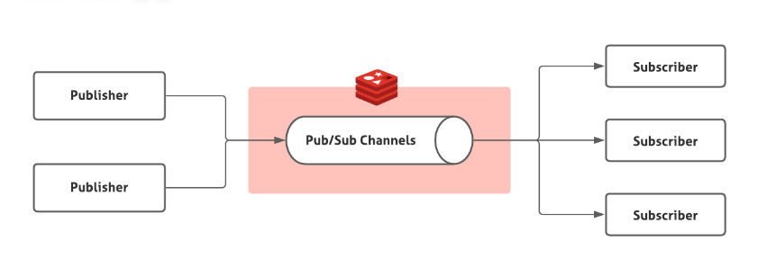

# Redis Pub/Sub
- `SUBSCRIBE`, `UNSUBSCRIBE`, `PUBLISH` 명령어로 Publish/Subscribe(발행/구독)의 메시징 패러다임을 구현한다.
- Publisher 가 특정 Subscriber 에게 직접 메시지를 보내는 것이 아니라, 메시지를 채널 단위로 발행하기 때문에 구독자자의 존재 여부를 따지지 않는다.
- Subscriber 는 하나 이상의 채널을 구독하여 자신이 구독한 채널에 발행된 메세지만 받게 된다.
- 이렇게 발행자와 수신자 사이의 직접적인 결합을 없애는 방식은 시스템의 확장성과 네트워크 구조의 유연성을 향상 시킨다.
- Pub/Sub은 Redis의 key space 와 무관하며, 내부적으로 DB 번호와도 관련이 없다. (전역적인 메시징 기능으로 만들어져서, 데이터 저장 공간과 분리된 레이어로 동작)

## 동작 예시
예를 들어, 클라이언트가 "channel11"과 "ch:00"이라는 두 채널에 구독하려면 다음과 같이 명령을 내린다.

`SUBSCRIBE channel11 ch:00`

이후, 다른 클라이언트가 PUBLISH 명령으로 이 채널들에 메시지를 발행하면, 해당 채널에 구독 중이던 클라이언트는 실시간으로 메시지를 푸시(Push) 방식으로 전달받게 된다. 메시지는 발행된 순서대로 구독자에게 전달되어 메시지 순서를 보장한다.

## Delivery Semantics
- Redis의 Pub/Sub은 "at-most-once" 메시지 전달 방식을 따른다.
- 메시지는 최대 한 번만 전달되며 재전송 되지 않는다.
- 만약, 애플리케이션에서 더 신뢰성 있는 메시지 전달이 필요하다면, Redis의 Streams 기능을 사용할 수 있다. (Streams는 메시지를 디스크에 저장하여 at-most-once뿐 아니라 at-least-once 방식도 지원한다.)
- 실시간성을 우선한 방식이기 때문에 빠르게 Push되고, 빠르지만 보장이 없는 구조이다.

## Redis Pub/Sub의 대표적인 활용 사례
- 실시간 알림 시스템
- 실시간 메세지 브로드캐스트
- 클라이언트 간 1:N 비동기 통신
- 빠른 속도가 중요하고, 신뢰성이나 내구성은 덜 중요한 문제 (ex. 사용자 실시간 접속 온/오프라인 정보 보여줄 때)

## 대표적인 명령어 목록

| 명령어                               | 설명                  |
| --------------------------------- | ------------------- |
| `SUBSCRIBE channel [channel ...]` | 하나 이상의 채널 구독        |
| `UNSUBSCRIBE [channel ...]`       | 채널 구독 해제            |
| `PUBLISH channel message`         | 채널에 메시지 발행          |
| `PSUBSCRIBE pattern`              | 패턴 기반 구독 (`ch:*` 등) |
| `PUNSUBSCRIBE pattern`            | 패턴 구독 해제            |

> Redis Pub/Sub은 패턴 기반 구독도 가능하다.
>
> SUBSCRIBE는 특정 채널 이름에만 반응하는데, PSUBSCRIBE는 패턴(glob-style)을 이용해서 여러 채널에 동시에 구독할 수 있고, 메세지를 받을 때도 타입이 달라진다.
>
> 패턴 매칭 결과로 받은 메시지는 pmessage 타입이다.
>   - `pattern`: 어떤 패턴에 의해 매칭되었는지
>   - `channel`: 실제로 메시지가 발행된 채널 이름
>   - `payload`: 메시지 본문
>
> 다만, 한 채널에 대해 여러 방식으로 구독하면, 같은 메시지를 여러 번 받을 수 있으므로 주의해야 한다!

## Redis Pub/Sub 사용할 때 주의해야 하는 부분?
1. Redis Pub/Sub은 메시지를 저장하지 않는다.
    - 구독하지 않은 상태에서 발행된 메시지나 네트워크 상태에 따라 유실된 메세지는 다시 받을 수 없다.

2. 메시지 유실 방지나 내구성을 보장해야 한다면 Redis Streams 이나 다른 MQ 사용을 고려해야 한다.

3. 애플리케이션 개발 시 Listener 등록에 주의해야 한다.
    - Redis 자체는 그냥 메시지를 채널에 푸는 역할만 하고, Spring에서는 그 메시지를 어떤 객체가 받아서 어떤 방식으로 처리할지 연결해야 하는데 이를 Listener 가 한다.
    - 리스너 바인딩에서 실수나 누락이 있으면 애플리케이션에서 메세지를 받아도 처리가 안된다.
    - 채널 등록이 동적으로 관리될 때, Listener 등록/해제도 동적으로 하는 방식이 주로 사용된다.
    - 또한, 다중 서버 환경에서 Listener 등록 문제를 주의해야하고, 중복 메세지 처리를 하지 않도록 주의해야한다.
        - Redis는 구독 중인 모든 서버에 메시지를 broadcast 하기 때문에 모든 서버가 동시에 메시지를 받게 되고, 같은 메시지를 중복 처리할 위험성이 생긴다.
        - ex. 한 명의 유저가 여러 서버에 동시에 접속하는 상황이나, DB에 메세지를 write 할 때 여러 번 쓰기 시도가 생길 수 있다.

## + 참고: Sharded Pub/Sub (Redis 7.0+)
- 등장 배경: 기존 Global Pub/Sub의 문제 극복
    - Redis 클러스터 모드에서 일반 Pub/Sub을 쓰면, 메시지가 클러스터의 모든 노드로 전파되었다.
    - 메시지가 많아질수록 클러스터 내부 네트워크 부하가 급격히 증가하는 단점
    - Push가 O(N) 방식으로 이루어지기 때문에 비효율적

- Sharded Pub/Sub의 핵심 원리
    - 채널도 키처럼 **slot 해시(slot hashing)**를 통해 특정 shard에 할당하고, 그 shard 내부에서만 메시지를 전파하도록 제한한다.
    - slot 단위로 샤딩이 가능해졌고, 이를 활용해서 Redis Pub/Sub도 본격적인 대규모 분산 확장이 가능해졌다.

- 최종적으로 Global Pub/Sub 보다 훨씬 가볍고 빨라 성능과 확장 모두를 잡았다.

---
ref.
- [Redis Docs: Redis Pub/Sub](https://redis.io/docs/latest/develop/interact/pubsub/)
- [Redis Pub/Sub으로 서버 원격 리로드 자동화하기](https://velog.io/@whdgnszz1/BE-Redis-PubSub%EC%9D%84-%EC%9D%B4%EC%9A%A9%ED%95%9C-%EC%9B%90%EA%B2%A9-%EB%A6%AC%EB%A1%9C%EB%93%9C-%EA%B8%B0%EB%8A%A5)