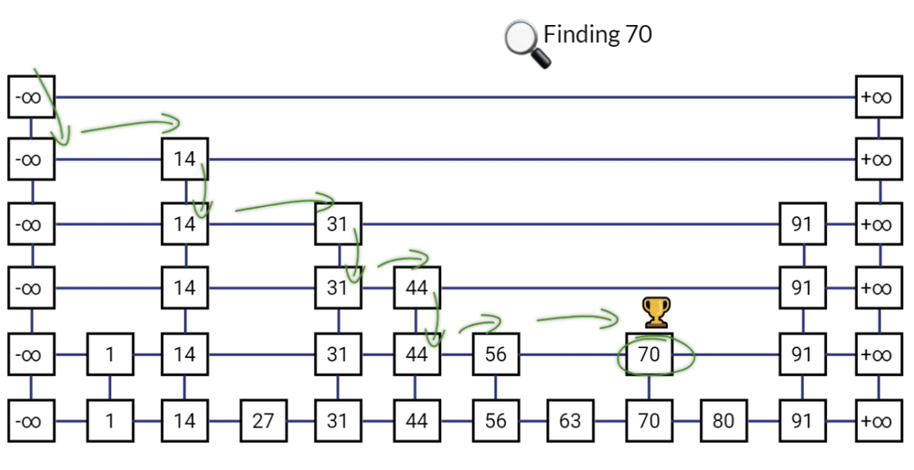

# Redis Sorted Set
- Sorted Set은 고유한 문자열(member)들의 집합으로, 각 유니크한 문자열에 연관된 score가 있어서 score를 기준으로 정렬된다.
- 여러 문자열이 같은 score를 가질 경우, 문자열 사전식으로 정렬된다.

## Sorted Set의 특징
### 1. Sorted Set은 Set과 Hash의 특징을 모두 가진다.
- Sorted Set은 고유한 문자열 요소들로 구성되며 중복이 없다는 점에서 일반적인 Set의 개념과 유사하다.
- 또한, 각 요소가 score에 매핑되어 있어 Hash 자료 구조와 같이 KV 쌍 구조로 볼 수 있다.
- 정렬된 상태를 유지하고 싶으면서도 빠른 조회가 필요한 경우에 사용한다.

### 2. 정렬 방식의 특징
- 요소들이 요청 시 정렬되는게 아니라, 자료구조 자체가 이미 정렬된 상태로 데이터를 유지한다.
- 여러 문자열이 같은 score를 가질 때, 문자열의 사전식으로 정렬되는데 이 때 문자열은 유니크한 것만 키로 허용되므로 자료 구조 안에 서로 같은 문자열 키가 존재할 수 없다.

## Redis Sorted Set의 핵심 구조
- 정렬과 빠른 조회를 동시에 가능하게 하기 위해 내부적으로 2가지 구조를 동시에 사용한다. (HashTable + Skip List)

| 구조             | 역할                        | 시간 복잡도                 |
| -------------- | ------------------------- | ---------------------- |
| **Hash Table** | 값 → 점수 (value → score) 매핑 | O(1) 조회                |
| **Skip List**  | 점수 → 값 정렬 구조 유지           | O(log N) 삽입, 삭제, 범위 조회 |

> `SkipList` 가 트리와 유사한 구조를 유지하여 트리와 유사한 수준인 O(log N)으로 탐색할 수 있다.

### SkipList
- Sorted Set 내부에서 정렬된 상태를 유지하는 핵심 구조
- Skip List는 정렬된 연결 리스트에 계층 구조(레벨)를 추가한 구조로, 탐색/삽입/삭제 시 평균적으로 O(log N)의 성능을 보장한다.

## SkipList 구조
- 레벨 0: 모든 데이터를 포함한 기본 연결 리스트
- 상위 레벨들: 일부 노드만 선택되어 포함되어 있는 “고속 경로” 역할
- 각 노드는 랜덤한 확률(p=0.5 등)로 상위 레벨에 포함되며, 이 확률 기반 구조 덕분에 전체 높이는 log N에 수렴한다.

> 삽입과 삭제 시에 연결 리스트의 삽입 삭제처럼 포인터만 조정하면 되기 때문에 트리보다 구현이 간단하고 메모리 접근이 연속적여서 캐시 효율이 높다.
> 
> 왜 연결 리스트인데 캐시 지역성이 높지? 라는 의문이 들 수 있는데,
> Redis는 일반적인 연결 리스트보다 메모리 할당 전략을 최적화해서 Skip List 구조에서도 상당한 수준의 캐시 지역성(locality)을 확보할 수 있도록 구현했기 때문이다.
>
> 자체적으로 성능 최적화된 allocator를 사용하여 노드들이 가까운 주소에 연속적으로 할당될 확률이 높아진다. 내부 SkipList의 이러한 특성이 인메모리 DB인 Redis에서 더욱 효율적으로 작동하게 만든다.

### 트리와 비교했을 때의 장점?
- 노드 삽입/삭제가 빈번해도 데이터 전체 재배치는 없다는 것이 강점이다.
- 트리 기반 구조는 balancing 때문에 자료 구조 전체에 영향을 줄 수 있지만 (Balance 유지 비용 등), SkipList는 local 포인터만 조작하면 되므로 삽입/삭제의 비용이 작고, 연속적인 메모리 접근 흐름을 유지하기 쉽다.

## Sorted Set의 대표적인 활용 사례
- LeaderBoards
    - 사용자 점수 관리, 랭킹 시스템, 인기 순으로 정렬 등, score 기반의 실시간 정렬이 필요한 곳에 쓰인다. (ex. 상위 N명 조회)
    - `ZRANK`, `ZINCRBY`로 순위를 실시간으로 갱신하고 비교할 수 있다.
    - ex. `ZREVRANGE leaderboard 0 9 WITHSCORES`
   

- RateLimiters
    - 제한/쿼터 시스템으로 특정 조건을 만족하는지 판별하는 시스템에도 활용 가능하다.
    - 특정 API나 웹사이트 요청의 남용을 방지하거나 시스템 과부하를 방지하는 데 사용할 수 있다. (조건을 걸어서 막음)
    - ex. 사용자의 요청을 timestamp로 정렬하여 특정 시간 내에 요청 횟수 초과 여부를 판단하고 막을 수 있다.
    - 대신 주의할 점으로, 요청에 대한 모든 로그를 메모리에 적재하면 악성 공격이나 트래픽이 몰릴 때, 메모리 관리에 유의해야 한다.

- TimeLines
    - 게시글, 로그, 이벤트 등에서 시간 순서로 정렬이 필요한 경우, timestamp 값을 score로 활용할 수 있다.
    

- LRU
    - score에 TTL, 접근 시간, 우선 순위 조건 등을 넣고 오래된 항목을 `ZPOPMIN` 으로 제거할 수 있다.

## 대표적인 명령어 목록

| 명령어                | 설명                              | 사용 예시                             | 시간 복잡도        |
| ------------------ | ------------------------------- | --------------------------------- | ------------- |
| `ZADD`             | 요소 추가 또는 업데이트 (score와 member 쌍) | `ZADD scores 100 "user1"`         | O(log N)      |
| `ZINCRBY`          | 특정 멤버의 점수를 증가시킴                 | `ZINCRBY scores 10 "user1"`       | O(log N)      |
| `ZRANGE`           | **낮은 점수 → 높은 점수** 정렬 결과 조회      | `ZRANGE scores 0 2 WITHSCORES`    | O(log N + M)  |
| `ZREVRANGE`        | **높은 점수 → 낮은 점수** 정렬 결과 조회      | `ZREVRANGE scores 0 2 WITHSCORES` | O(log N + M)  |
| `ZRANK`            | 특정 멤버의 순위 조회 (낮은 점수 기준)         | `ZRANK scores "user1"`            | O(log N)      |
| `ZREVRANK`         | 특정 멤버의 순위 조회 (높은 점수 기준)         | `ZREVRANK scores "user1"`         | O(log N)      |
| `ZSCORE`           | 특정 멤버의 현재 score 조회              | `ZSCORE scores "user1"`           | O(1)          |
| `ZREM`             | 특정 멤버 제거                        | `ZREM scores "user1"`             | O(log N)      |
| `ZCARD`            | 집합 내 멤버 수 반환                    | `ZCARD scores`                    | O(1)          |
| `ZPOPMIN`          | **가장 낮은 score**의 멤버 제거 및 반환     | `ZPOPMIN scores`                  | O(log N)      |
| `ZPOPMAX`          | **가장 높은 score**의 멤버 제거 및 반환     | `ZPOPMAX scores`                  | O(log N)      |
| `ZRANGEBYSCORE`    | 특정 score 범위에 해당하는 멤버들 조회        | `ZRANGEBYSCORE scores 50 100`     | O(log N + M)  |
| `ZREMRANGEBYSCORE` | 특정 score 범위의 멤버들 제거             | `ZREMRANGEBYSCORE scores 0 30`    | O(log N + M)  |
| `ZSCAN`            | 커서 기반 순회 (대량 데이터 탐색용)           | `ZSCAN scores 0`                  | O(1) per call |

## Redis Sorted Set 사용할 때 주의해야 하는 부분?
1. score의 Type이 Float 으로 처리되므로 정밀도에 주의해야 한다.
    Redis 내부에서 score는 double 타입으로 처리되기 때문에 오차 가능성 발생
    → 정수로 한정하는 방법 등, 정확한 score 관리 필요

2. Sorted Set은 메모리 사용량이 높은 구조이므로 메모리 관리 주의
    많은 데이터와 높은 빈도의 삽입/삭제가 반복될 경우 성능에 영향을 줄 수 있다.

3. 중복되는 score 처리 주의
    score가 같을 경우에는 Redis가 사전순으로 정렬하는데, 의도하지 않은 순서가 나올 수 있다.
    score를 고유하게 구성하거나 보조 키(타임스탬프, ID 등)를 활용하는 추가 전략을 줄 수 있다.

4. 단일 키에 너무 많은 데이터를 넣는 것 주의
    Redis는 단일 키에 많은 엔트리가 들어갈 수 있으나, 메모리 증가 및 조회 시 레이턴시 증가 가능성 있으므로 유의

---
ref.
- [Redis docs: Redis Sorted Set](https://redis.io/docs/latest/develop/data-types/sorted-sets/)
- [Redis Skip List](https://medium.com/@chnwsw01/redis-skiplist-20e35831d9e7)