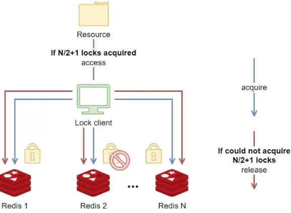
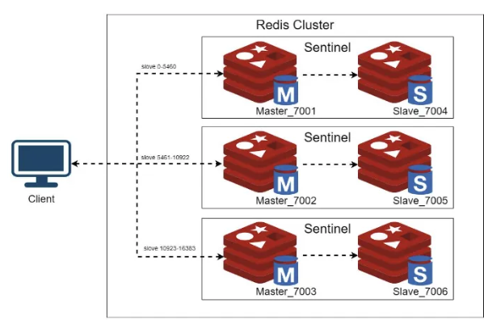
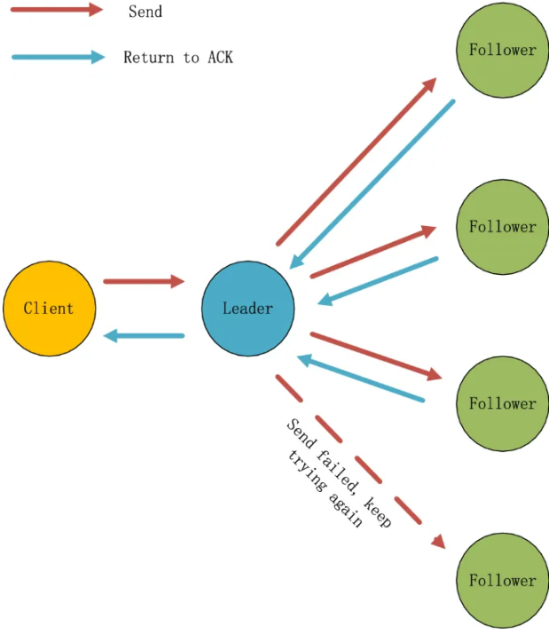

### 레디스 분산락


Distributed locks는 특정한 리소스를 공유하는 많은 프로세스 사이에서 상호 배제를 구현하는 대에  사용이 된다. 여러 플랫폼에서 다양한 구현이 있지만 보통 Java 진영에서 사용할 수 있게 구현이 된 것은 Redisson이라는 게 사용이 된다.

Redisson은 장단점이 명확하다.

- 장점
    - 고수준의 추상화된 API를 제공한다.(Lock 구현체를 상속 받아 만들어져 있다, concurrent 패키지의 lock의 구현체)
    - 스핀락이 아닌 pub/sub 기능을 활용해 만들어지기 때문에 락에 대해서 지속적으로 불필요한 재시도를 하지 않아 불필요한 자원 낭비와 부하 발생이 줄어든다.

      → 타임 아웃 설정과 LuaScript가 자동적으로 설정이 되어 있고 락의 획득 가능 여부에 대해서 atomic한 연산을 구현체로 제공한다.(Lettuce에 비해서 자유도는 낮지만 필요한 기능이 구현되어 있어 가져다 쓰기가 쉽다.)

    - 다양한 모드들에 대해서 설정하면 해당 설정에서의 Lock 구현을 해준다. Single-node부터 Replicated nodes까지 5개가 존재함.(https://www.baeldung.com/redis-redisson)
- 단점
    - 자유도가 낮다. 높은 성능과 다양한 상황에서 적용 가능성이 낮다.(적용이 불가능한 환경이 존재한다는 의미)
    - 라이브러리가 작지 않다. 또한, 해당 라이브러리에 대한 의존성이 발생함.

대부분의 우리가 일반적으로 진행하는 토이 프로젝트 규모에서는 Redisson 구현체를 사용한다고 문제가 생기지는 않겠지만 특정한 상황에서 Redisson 라이브러리를 사용하지 못하는 경우와 이 때 단일 Redis 인스턴스로 구현을 했을 때 어떤 문제가 일어나는 지에 대해서 알아볼 필요가 있다고 생각해 이걸 주제로 잡게 됨.

레디스를 통한 분산락의 기본적인 아이디어는 String 자료구조 등을 활용해서 key-value 값에 key값을 획득할 수 있으면 잠금을 획득하고 아니라면 대기하는 걸 활용한다.

레디스에서는 아래처럼 명령어를 쓰면 resource_name을 키로하고 my_random_value를 값으로 한 String 값을 놓고 이전에 존재하지 않는다면 30초 뒤에 만료되도록 설정한다는 것을 의미한다.

```redis
  SET resource_name my_random_value NX PX 30000
```

레디스에서 연산과 관련된 부분은 싱글 쓰레드로 동작을 한다. 그래서 위의 과정만으로는 경쟁적인 문제가 발생하지 않는다. 대신 발생할 수 있는 문제가 있는 세 가지 케이스 정도를 생각해봤다.

1. 해당 잠금을 들고 작업을 오랫동안 처리해야 할 때

만약에 특정한 작업이 5초가 걸려서 끝난다고 해보자. 그러면, 값의 만료시간이 3초라고 할 때, 아직 작업이 끝나지 않았을 때에 잠금이 만료될 수 있다. 이런 경우에는 적절한 잠금을 위한 값을 설정하지 못한 것이다. 이 경우엔 작업 시간을 줄이거나, 잠금을 유지하는 시간을 키워야 한다.

2. 해당 잠금을 획득하지 않은 외부에서의 해당 잠금 강제 해제

특정 key-value으로 된 String 자료구조를 잠금으로 활용을 한다고 했을 때 발생할 수 있는 문제는 사실 key만 알면 DEL 명령어를 통해서 해당 잠금을 획득하지 않은 바깥의 누군가가 해당 명령어를 key값만 안다고 실행하지 못하도록 막아야 한다. 그렇지 않으면 설정한 잠금획득이 끝나기 전에 해당 값이 소멸되면서 아직 잠금을 획득한 누군가가 임계영역에 들어왔음에도 불구하고 그 임계영역에 또 다른 누군가가 들어올 수 있기 때문이다.

따라서, 다른 누군가가 해제하지 못하게 하도록 설정을 한다. 그렇기 때문에 key에 대한 value값이 일치하는 누군가만 해당 잠금을 시간이 만료되기 전에 해제할 수 있게 해야 한다. 그런데 레디스의 연산이 싱글쓰레드로 돌아간다고 해서 이것까지 보장해주지 않는다. 이건 원자적이지 않은 행위이다. 행위를 분석해보면 이렇게 나눠 볼 수 있다.

- 특정 key에 적힌 value 값을 확인한다.
- 특정 key에 적힌 value가 현재 value와 일치하는 경우 del 연산을 통해 해당 key 값을 지운다.

해당 연산은 두 가지 연산으로 나뉘어져 있으며 확인하고 지우기 전에 다른 연산이 들어올 수 있다. 이를 위해서는 Lua Script와 같이 원자적인 연산을 활용할 수 있는 방법을 사용해야 하고 공식문서에서는 Lua Script를 권장한다. 또한 아래처럼 설정할 것을 권한다.


```redis
if redis.call("get",KEYS[1]) == ARGV[1] then
    return redis.call("del",KEYS[1])
else
    return 0
end
```

3. 레디스 서버 자체가 다운되는 경우

레디스를 분산락 전용 인스턴스로 사용하는 경우에는 일반적인 경우엔 key 값을 정말 크게 잡거나 하지 않는 이상 일반적인 경우에는 다운되는 일이 없을 것이다. 우리가 진행하는 대부분의 토이프로젝트에서는 분산락 + 다른 추가적인 인스턴스로 써도 문제가 발생하지 않는다. 하지만, 현업에서는 레디스를 단일 인스턴스로 사용한다면 사용자가 많은 서비스의 특성상 레디스 인스턴스가 다운되는 문제가 충분히 발생할 수 있다고 한다.

이런 경우에 고려할 수 있는 가장 쉬운 방법은 Replication과 같이 복제 노드를 하나 만들어서 서로 동기화를 시켜주는 방법이 있다. 그런데, Replication은 비동기적인 방식으로 일어난다. 그래서 만약에 Master 노드가 다운되면 Slave가 Failover(Slave가 Master 노드의 log를 보고 복구)를 통해 문제가 해결될 수 있을 것 같지만 문제가 발생한 시점 근처의 키 혹은 일부 지연으로 인해서 손실되는 값들로 인해서 승격되는 시간 동안 상호배제를 보장하지 못하는 문제가 발생할 수 있다.

따라서, 이런 문제에 대한 고가용성(HA)를 보장하기 위해서 Replication은 허점이 많은 방식이다. 락에 대한 고가용성을 위해서 Redis 측에서 권장하는 방식은 RedLock 방식이다.  아래의 이미지처럼 여러 개의 Redis 인스턴스를 두고 동시에 락 획득을 하고, 전체 레디스 인스턴스가 2N + 1개(N은 자연수)라면 N + 1 개의 정족수를 채우면 해당 락을 획득한 걸로 ‘간주’하는 방식이다.



따라서, 개별 인스턴스는 사실상 독립된 인스턴스이고 서로의 동기화 이런 것은 신경을 쓰지 않는다고 보는 게 맞다. 단지 해당 락을 획득을 요청하는 누군가가 해당 전체 2N + 1개의 개별적인 인스턴스에게 동시에 요청을 비동기적으로? Multiplexing 방식으로? 보내고 그 중 N + 1개의 노드에서만 획득할 수 있다고 하면 정족수의 과반을 넘겼으므로 락을 획득해서 특정 서버가 다운되더라도 정족수만 넘으면 문제가 없게 만드는 개념이다.

그렇기 때문에 다음과 같은 특징이 있다.

- 두 사용자가 동일한 숫자의 노드로부터 락을 획득해서 동시에 특정한 값에 접근하는 문제가 발생하지 않도록 홀수 개의 노드를 설정한다.
- 노드에 대한 락을 최대한 빨리 획득해야 하며 만약에 개별 Redis 인스턴스에서 TTL을 30초로 두었다고 하고 처음 락을 획득한 시점부터 마지막 락을 획득하기까지 5초가 걸렸다고 하면 사실상 TTL은 처음 획득한 시점으로부터 계산해서 25초로 보아야 한다. 그래서 락을 획득하는 시간이 긴 경우 TTL을 더 늘려서 설계해야 한다.
- 개별 인스턴스는 아마도 서로 몰라도 된다. 단지 특정한 Lock을 획득하는 클라이언트만 홀수 개의 노드에 접근을 하기만 하면 된다.

RedLock은 일부 GC나 Clock Drift에 의한 문제가 발생할 수도 있다는 지적이 있는 알고리즘이다.
RedLock은 완벽하지 않은 알고리즘이지만 대부분의 경우 문제를 해결할 수 있는 알고리즘이다. 
하지만, 그런 문제를 겪을 일은 거의 없으며, 만약에 그런 문제를 겪는다면 ZooKeeper 등의 솔루션에 대해서도 스스로 공부해보는 걸 권장한다.

아마 N개의 노드가 컸을 때 혹은 네트워크 지연 등으로 TTL이 길어지는 게 문제가 발생할 수 있다는 지적일 것 같다는 생각이 조금 들긴 하지만 해당 개념에 대해서는
아직은 배우지 않아도 된다고 생각하여 생략하였다.

### 헷갈리는 유사한 개념들

해당 방식은 클러스터와 헷갈릴 수도 있다. 
왜냐하면 레디스 클러스터링은 어떻게 보면 복구와 관련도 있기 때문에 비슷한 이미지로 돌아가고 각각의 노드들에 대한 고가용성을 위해서 비슷한 구조를 취하기 때문이다.
하지만 이와는 크게 관련이 없다. 클러스터는 사실상 샤딩의 개념으로 보는 게 맞다. 
또한 사실상 RedLock은 Slave노드가 없고 각각의 인스턴스를 독립적인 개별 노드로 간주하며 모두 동일한 key-value를 획득하고자 하기 때문에 복구의 개념과 샤딩의 개념과 멀다.



그리고 비슷한 정족수 기반의 Raft 알고리즘으로 고가용성을 취할 수도 있는데, 이는 샤드와 관련이 없다.
정확하게 말하면 마치 지금 Master 노드에 단일 Slave 노드만 붙어 있어 마치 Active-Standby 형태로 구조가 되어있는데 Raft 알고리즘은 Slave가 여러 개여서 어떤 노드가 다음 Master 혹은 Leader로 선출될 지에 대한 선출 방법에 대한 알고리즘이다.




### 참고자료
- https://redis.io/docs/latest/develop/use/patterns/distributed-locks/
- https://martin.kleppmann.com/2016/02/08/how-to-do-distributed-locking.html (추가적으로 심화용으로 읽기 권장)
- https://hyperconnect.github.io/2019/11/15/redis-distributed-lock-1.html (문제점과 해결 방법 찾기 권장)
- https://mangkyu.tistory.com/311 (해당 위의 개념과 유사하지만 조금 더 개념적인 부분에 대해서 잘 설명한 글)